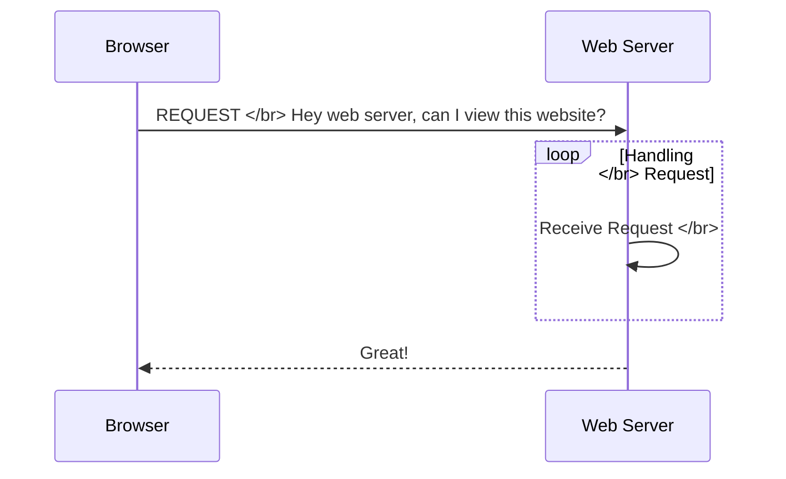

# Serving Content Over The Web

```mermaid
sequenceDiagram
  participant Browser

  Browser->>Web Server: REQUEST </br> Hey web server, can I view this website?

  loop Handling </br> Request
  Web Server->>Web Server: Receive Request </br>
  end

  Web Server-->>Browser: Great!
```
