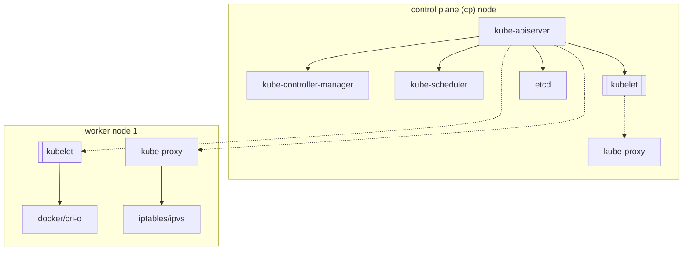

# Kubernetes Concepts
- [Kubernetes Concepts](#kubernetes-concepts)
  - [Nodes](#nodes)
  - [Clusters](#clusters)
  - [A Master Node](#a-master-node)
  - [Worker Nodes](#worker-nodes)
  - [Components](#components)
    - [API Server](#api-server)
    - [ETCD Key Store](#etcd-key-store)
    - [Kubelet](#kubelet)
    - [Container Runtime](#container-runtime)
    - [Controllers](#controllers)
    - [Scheduler](#scheduler)
  - [Kubectl](#kubectl)
  - [Other Terminology](#other-terminology)
    - [Control Plane Node](#control-plane-node)
    - [Watch Loops](#watch-loops)
    - [DaemonSet](#daemonset)
    - [Kube-ApiServer](#kube-apiserver)
    - [Kube-Scheduler](#kube-scheduler)
  - [A Diagram](#a-diagram)

With Kubernetes, one of the primary goals is to...
- deploy app(s)
- in containers
- on machines
- configured as "worker nodes" in a cluster

K8s does not deploy containers directly on a worker node, though.  
Containers are encapsulated in [pods](/k8s/on-pods): single instances of an app or suite of tightly-coupled apps. Pods are the smallest object that can be created/managed in K8s.  

## Nodes
A node is a machine, physical or virtual, where K8s is installed. Nodes might be known as minions.  

## Clusters
A cluster is a set of nodes. Clusters are helpful for load management, replication, and handling single-node failure.  

## A Master Node
A Node with K8s installed.  
This node "watches" && manages other nodes in a cluster.  
The master server has the kube API server on it. This "talks to" the kubelet tool on the worker nodes.
All info about the worker nodes is stored on the master with the etcd component/service.  
THe master has both the controller and scheduler on it.

## Worker Nodes
- contain the container runtime, docker here
- contain containers

Minions. These host the container runtimes and containers. 
These have the kubelet agent on them, which is used to interact with the master node.  

## Components
Installing Kubernetes is installing some "components".
### API Server
- the "frontend" for K8s
- allows interaction w/ k8s cluster
- cli talks to api server to talk to the cluster
### ETCD Key Store
- stores data to manage the cluster
- a distributed reliable key-value store
- responsible for implementing logs within clusters to alleviate any potential conflicts between master nodes
- etcd stores info in ALL NODES IN THE CLUSTER

### Kubelet
- the agent that runs on each node in a cluster
- makes sure the containers are running as expected

### Container Runtime
- will prob be docker
- others exist!

### Controllers
- the "brain" behind orchestration
- "notice" when containers stop working
- starts new containers

### Scheduler
- Distributes work & containers across nodes
- looks for new containers && assigns them to notes

## Kubectl
A kube command-line tool.  
Used to deploy + manage kubernetes apps on a K8s cluster: 
- get cluster info
- get info about pods, services, etc

```bash
# deploy an app on a cluster
kubectl run hello-minikub

# see info about the cluster
kubectl cluster-info

# list the nodes in the cluster
kubectl get nodes
```

## Other Terminology

### Control Plane Node
The K8s master runs servers and manager processes for the cluster: the kube-apiserver, etc. 
### Watch Loops
another name for controllers.  

### DaemonSet
Ensures that all nodes run a copy of a pod.  
Interesting!  
An example DaemonSet config file, lifted from the [K8s Docs](https://kubernetes.io/docs/concepts/workloads/controllers/daemonset/):   
```yaml
apiVersion: apps/v1
kind: DaemonSet
metadata:
  name: fluentd-elasticsearch
  namespace: kube-system
  labels:
    k8s-app: fluentd-logging
spec:
  selector:
    matchLabels:
      name: fluentd-elasticsearch
  template:
    metadata:
      labels:
        name: fluentd-elasticsearch
    spec:
      tolerations:
      # these tolerations are to have the daemonset runnable on control plane nodes
      # remove them if your control plane nodes should not run pods
      - key: node-role.kubernetes.io/control-plane
        operator: Exists
        effect: NoSchedule
      - key: node-role.kubernetes.io/master
        operator: Exists
        effect: NoSchedule
      containers:
      - name: fluentd-elasticsearch
        image: quay.io/fluentd_elasticsearch/fluentd:v2.5.2
        resources:
          limits:
            memory: 200Mi
          requests:
            cpu: 100m
            memory: 200Mi
        volumeMounts:
        - name: varlog
          mountPath: /var/log
        - name: varlibdockercontainers
          mountPath: /var/lib/docker/containers
          readOnly: true
      terminationGracePeriodSeconds: 30
      volumes:
      - name: varlog
        hostPath:
          path: /var/log
      - name: varlibdockercontainers
        hostPath:
          path: /var/lib/docker/containers
```


### Kube-ApiServer
Central to a K8s Cluster.  
Handles all calls, actions, validations, etc, both internally and externally.  
This is the only agent connected to the etcd db.  

### Kube-Scheduler
Determines which node(s) host which pod(s).  
Tries to view resource availability.  

## A Diagram
