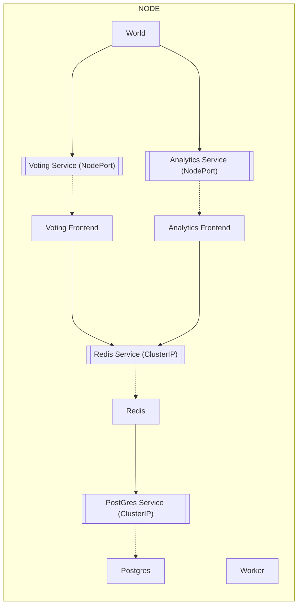

# A Case Study in Microservices
Lets take an example codebase. 
- [A Case Study in Microservices](#a-case-study-in-microservices)
  - [A Traditional Small Client to Server to DataStore](#a-traditional-small-client-to-server-to-datastore)
    - [Voting App: The Frontend](#voting-app-the-frontend)
    - [A Datastore](#a-datastore)
      - [Docker for Developers](#docker-for-developers)
  - [A Small App Grows with An In-Memory Store and a Worker Process](#a-small-app-grows-with-an-in-memory-store-and-a-worker-process)
    - [Even More Apps to Manage for Docker](#even-more-apps-to-manage-for-docker)
  - [A New App Is Requested](#a-new-app-is-requested)
    - [One more app for Docker](#one-more-app-for-docker)
  - [Managing Across Hosts From Docker to Kubernetes](#managing-across-hosts-from-docker-to-kubernetes)
    - [Identifying Kubernetes Services](#identifying-kubernetes-services)
    - [Starting with 1 Pod Per Service](#starting-with-1-pod-per-service)
      - [Understand the Connectivity Reqs](#understand-the-connectivity-reqs)
      - [Understanding services and ports](#understanding-services-and-ports)
      - [Leveraging Services to Enable Pod Connections](#leveraging-services-to-enable-pod-connections)
  - [A Visual](#a-visual)

## A Traditional Small Client to Server to DataStore
A small and functional "Full-Stack" application can include:

### Voting App: The Frontend
The UI of a project: HTML, JS, CSS, making network requests to an http server.  
The API of a project: an http server that serves, maybe, a rest api as well as the frontend of the project.

### A Datastore
Something - like postgres.  

#### Docker for Developers
In production, the ui will be served from the same server as the api.  
In development, though, when building with a library like react, the frontend is usually served with something like [webpack-dev-server](https://github.com/webpack/webpack-dev-server).  
Managing the separate parts can become a purely time-consuming burden, though.  

As a frontend developer, having the api and the datastore both running locally can become a burden: when updates to the db and api are made "asynchronously", effort by the frontend folks is required to update the db and the api.  

Containerizing the db and the api reduce the amount of effort to manage the db and api. 

## A Small App Grows with An In-Memory Store and a Worker Process
Say the speed of the ui wants to be increased & the team decides to add a redis store to the stack.  
The redis store gets added to the stack.  

With the in-memory store in the stack, the data transfer speeds increase significantly. Effort, then, needs to be built into the frontend api server to "manage" the state between the redis store and the db.  

This effort ends up being broken out into a stand-alone "service" where it's entire job is to manage the data between the redis in-memory data store and the db. This is the "worker", and it relieves its computational workload from the voting app.  

### Even More Apps to Manage for Docker
Docker is now definitely a good candidate for these repositories:
- the frontend api + ui
- the in-memory redis store
- the worker process
- the db

## A New App Is Requested
An "analytics" ui is requested by the client. This will serve management within an org, not the same end-users of the starting UI.  The team decides to make this it's own api + frontend.  

### One more app for Docker
- the frontend api + ui
- the in-memory redis store
- the worker process
- the db
- the new analytics api + ui

## Managing Across Hosts From Docker to Kubernetes

### Identifying Kubernetes Services
The above 5 parts 
- will get deployed in containers
- will leverage connectivity
- will allow access to services & pods where needed

### Starting with 1 Pod Per Service
#### Understand the Connectivity Reqs
- **redis**
  - accessed by voting & worker app
  - voting app saves the vote to redis
  - worker reads from redis
- **postgres**
  - accessed by worker and results app
  - worker updates the total count of votes
  - results app reads from it for display
- **worker**
  - not accessed by any other service
  - only accesses other apps

#### Understanding services and ports
- voting-app on 80
- redis on 6379
- results-app on 80
- postgres on 5432
- worker... no ports available by others!

Note, the services should not refer to one another by I.P address. The services should....use other services... to talk to one another.  
 
#### Leveraging Services to Enable Pod Connections
Services are only required for a pod when the pod needs to be accessed by another pod:  
- **for the redis pod**
  - to allow the redis pod to be accessed by voting app && worker app
  - redis won't be accessed outside the cluster
  - the service type will be **clusterIP**
- **for postgres pod**
  - accessed by worker
  - accessed by one of the frontent apps
  - db connection credentials will be "known" by those two pods
  - type ClusterIP
- **enabling external access**
  - NodePort type
  - 1 service for voting app
  - 1 service for result analytics dashboard app
- No service for the worker pod
  - reads from a db, updates another db

## A Visual
