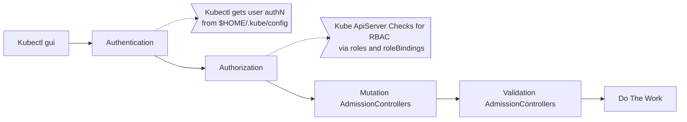

# Admission Controllers
Every time a request goes through the kubectl cli...
- the req. goes to api server
- the req. gets **authenticated**, usually through certificates
  - kubectl uses the kubeconfig file, which has certs configured
- the req is **authorized**
  - does the user have the permission to do what they are trying to? RBAC check, usually
- the api serve runs **mutation admissionControllers**
- the api serve runs **validation admissionControllers**
- info is persistent in the etcd database




- [Admission Controllers](#admission-controllers)
  - [Permissions can be more granular than user RBAC with Admission Controllers](#permissions-can-be-more-granular-than-user-rbac-with-admission-controllers)
    - [Why We Need Admission Controllers](#why-we-need-admission-controllers)
    - [AdmissionControllers Validate and Mutate](#admissioncontrollers-validate-and-mutate)
    - [Some Built-In AdmissionControllers](#some-built-in-admissioncontrollers)
    - [View All Enabled Admission Controllers](#view-all-enabled-admission-controllers)
    - [Add An Admission Controller](#add-an-admission-controller)

## Permissions can be more granular than user RBAC with Admission Controllers
Some use-cases for different authz checks:
- review pod config for specifics
  - non-public images allowed
  - block the tag `latest`
  - block running containers as root user
  - assure metadata has specific labels present

AdmissionControllers to the rescue.  
AdmissionControllers "live" in the apiserver, and are bits of code.  
AdmissionControllers can change requests and do its own work during a request.  

### Why We Need Admission Controllers
Per the [K8s Docs on this subject](https://kubernetes.io/docs/reference/access-authn-authz/admission-controllers/#why-do-i-need-them), with seemingly strong language,  
_"...a Kubernetes API server that is not properly configured with the right set of admission controllers is an incomplete server..."_

### AdmissionControllers Validate and Mutate
Mutations first.  
Validations second.  
Also, these controllers can perform side-effects on non-request objects.  

During the request lifecycle, if either of the controllers reject the request due to some missed mutation or validation, the entire request is rejected with an err.  

### Some Built-In AdmissionControllers
- `AlwaysPullImages`
  - ensures images are pulled prior to pod creation
- `DefaultStorageClass`
  - observes creation of pvcs and sets a default storage class if none is present
- `EventRateLimit`
  - sets limit on requests to prevent the api server from flooding with req
- `NamespaceExists`, deprecated
  - rejects requests to namespaces that don't exist
- `NamespaceAutoProvision`
  - **not automatically enabled, and deprecated** but present and allowed to be enabled
  - when a new namespace is referenced, but the namespaces is not created first, the namespace is created on-the-fly
- `NamespaceLifecycle`
  - replaces the above 2 admission controllers
  - default namespace cant be deleted
  - auto-rejects object handling in namespaces that are not present
- ...there are a more

### View All Enabled Admission Controllers
```bash
kube-apiserver -h | grep enable-admission-plugins
```  
### Add An Admission Controller
Edit the kube-apiserver.service file.  
```bash
# add this flag, here with example vals
--enable-admission-plugins=NodeRestriction,NamespaceAutoProvision

```