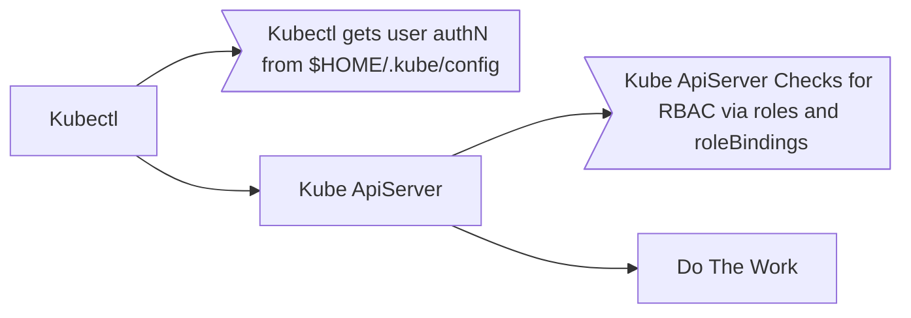

# Admission Controllers
Every time a request goes through the kubectl cli...
- the req. goes to api server
- the req. gets authenticated, usually through certificates
  - kubectl uses the kubeconfig file, which has certs configured
- the req is authorized
  - does the user have the permission to do what they are trying to? RBAC check, usually
- the object is handle
- info is persistent in the etcd database

## Permissions can be more granular than user RBAC with Admission Controllers
Some use-cases for different authz checks:
- review pod config for specifics
  - non-public images allowed
  - block the tag `latest`
  - block running containers as root user
  - assure metadata has specific labels present

AdmissionControllers to the rescue.  
AdmissionControllers "live" in the apiserver, and are bits of code.  
AdmissionControllers can change requests and do its own work during a request.  

### Why We Need Admission Controllers
Per the [K8s Docs on this subject](https://kubernetes.io/docs/reference/access-authn-authz/admission-controllers/#why-do-i-need-them), with seemingly strong language,  
_"...a Kubernetes API server that is not properly configured with the right set of admission controllers is an incomplete server..."_

### AdmissionControllers Validate and Mutate
Mutations first.  
Validations second.  
Also, these controllers can perform side-effects on non-request objects.  

During the request lifecycle, if either of the controllers reject the request due to some missed mutation or validation, the entire request is rejected with an err.  

### AdmissionController Options
- AlwaysPullImages
- DefaultStorageClass
- EventRateLimit