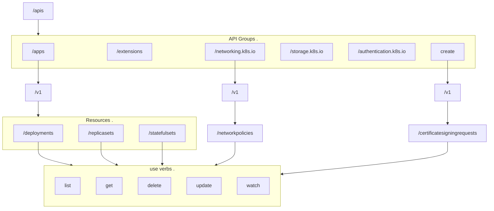

# There Is A Kubernetes Api Server
Check out the 
There are a bunch of endpoints that can be accessed at `curl https://kube-master-node-ip:6443/<many-endpoints>`:
- metrics
  - monitor health of cluster
- healthz
  - monitor health of cluster
- version
  - cluster version
- api
- apis
- logs
  - integrating with 3rd-party logging apps


- [There Is A Kubernetes Api Server](#there-is-a-kubernetes-api-server)
  - [Use Auth When requesting to the api](#use-auth-when-requesting-to-the-api)
    - [Note Differences Between Kube Proxy and Kubectl Proxy](#note-differences-between-kube-proxy-and-kubectl-proxy)
  - [Apis Responsible For Cluster Functionality](#apis-responsible-for-cluster-functionality)
  - [A Visual](#a-visual)
  - [APIs might be versioned](#apis-might-be-versioned)
    - [APIs can be enabled and disabled](#apis-can-be-enabled-and-disabled)
    - [APIs Get Deprecated](#apis-get-deprecated)
      - [Removing Endpoint by excluding in new verisons](#removing-endpoint-by-excluding-in-new-verisons)
      - [Prior Version Maintenance SChedules](#prior-version-maintenance-schedules)
      - [Use Kubectl Convert to get new apis](#use-kubectl-convert-to-get-new-apis)
  - [Todo](#todo)


## Use Auth When requesting to the api
One option is to pass cert details to curl
```bash
curl https://localhost:6443 -k
  --key admin.key
  --cert admin.crt
  --cacert ca.crt
```

Another option is to use a built-in kubectl proxy client. This launches a proxy service on port 8001 && uses creds +certs from the default kubecconfig file. This way, keys + certs are not required for every api request
```bash
# setup the proxy
kubectl proxy
# starting to serve on 127.0.0.1:8001

curl https://localhost:8001 -k
# works!
```

### Note Differences Between Kube Proxy and Kubectl Proxy
The kubectl proxy is for api access.  
The Kube Proxy is a k8s object enabling connectivity between k8s objects in the k8s cluster.  

## Apis Responsible For Cluster Functionality
kubectl uses these apis under the hood, i think!

- `/api`
  - core group of apis
  - `/v1`
    - namespaces
    - events
    - bindings
    - configmaps
    - pods
    - endpoints
    - PV
    - secrets
    - rc
    - nodes
    - pvc
    - services
- `/apis`
  - apps
    - v1
      - deployments
        - list, get, create, delete, update, watch
      - replicasets
        - list, get, create, delete, update, watch
      - statefulsets
        - list, get, create, delete, update, watch
  - extensions
  - networking.k8s.io
    - v1
      - networkpolicies
  - storage.k8s.io
  - authentication.k8s.io
  - certificates.k8s.io
    - v1
      - certificatesigningrequests


## A Visual
The api resource url "hierarchy": 


## APIs might be versioned
Each API can have versions: 
- `v1Alpha1`
  - can implement in an object def file with `apiVersion: internal.apiserver.k8s.io/v1alpha1`
  - first developed + merged to k8s codebase
  - may have bugs
  - may be dropped
  - experts can use it and give feedback
  - these alpha apis are not enabled by default
- `v1Beta1`, `v1Beta2`
  - once major bugs are fixed, anbd e2e tests are built, alpha apis move here
  - not GA
  - may have minor bugs
  - commitment that the api may be moved to GA
- `v1` is the GA stable verison 
  - expected to be highly reliable
- **multiple versions might be supported at a time**
  - **the preferred** version is set in `cluster/apis/<api-here>`, like `batch`
  - **the storage** is which the object is STORED: may be different than the explicitly defined in an object definition file
    - the stored version of an object, and its api-version can be discovered by querying the etcd db, where the object is at - an example get query for a deployment named `blue`

```bash
ETCDCTL_API=3 etcdctl
 --endpoints=https://[127.0.0.1]:2379
 --cacert=/etc/kubernetes/pki/etcd/ca.crt
 --cert=/etc/kubernetes/pki/etcd/server.crt
 --key=/etc/kubernetes/pki/etcd/server.key
 get "/registry/deployments/default/blue" --print-value-only
```

### APIs can be enabled and disabled
The version must be added to the runtime config parameter of the kube-apiserver service with new lines like this mock: `--rintime-config=<api/version>`
- `--runtime-config=batch/v2alpha1`

### APIs Get Deprecated
API deprecation policies express when to stop supporting apis.  
As an example, say we make an api for k8s called `/imaginelife` with sub-routes at `/imaginelife/courses` and `/imaginelife/webinar`.  
When its ready to be merged to k8s, it gets merged as `/imaginelife/v1alpha1/courses`, etc.  
This can now be used with something like
```yaml
apiVersion: imaginelife/v1alpha1
kind: Course
metadata:
  name: first-course-here
spec:
# specs....
```

#### Removing Endpoint by excluding in new verisons
To "remove" an endpoint really only works by NOT INCLUDING the deprecated enpoint in a new version of the api. To "remove" the `webinar` endpoint, per say, that endpoint would just not be included in a `v1alpha2` release alongside the `imaginelife/v1alpha2/courses` release.  

#### Prior Version Maintenance SChedules
Other than the most recent API version of each endpoint, co-inciding with kubernetes version releases, prior API versions are required to be supported after their "announced deprecation" for a min duration of ....
- `GA`: 12 months or 3 releases, the longer of the two
- `beta`: 9mo or 3 releases, the longer of the two
- `alpha` none-zo!
  - must announce api version changes in k8s release notes

Api Version can only deprecate same-"level" of availability or lower: 
- new alpha releases can deprecate prior alpha releases
- new beta releases can deprecate prior alpha AND beta releases
- new GA releases can deprecate prior alpha, beta, and GA releases
- new alpha CANNOT deprecate beta or GA releases
- new beta CANNOT deprecate GA releases


#### Use Kubectl Convert to get new apis
[K8s docs on kubectl-convert](https://kubernetes.io/docs/reference/using-api/deprecation-guide/#migrate-to-non-deprecated-apis).  

When an api is deprecated, the `kubectl convert` command can be used to help migrate a k8s config file to a new api version:

```bash
# kubectl-convert -f old-config-file.yaml --output-version new-version-here
kubectl-convert -f app-deployment.yaml --output-version apps/v1
```  


## Todo
- show the "short names" of resources in k8s, say deployments and cronjobs
  - `kubectl api-resources | grep 'deployments\|replicasets'`
- identify parts of a semver
- id wich api "group" (_version_) a given resource is part of, say the `job` resource
  - `kubectl explain job`
- id the preferred version for `authorization.k8s.io` api group
- enable a `v1alpha1` version for `rbac.authorization.k8s.io` api group on the `controlplane` node
  - edit the `/etc/kubernetes/manifests/kube-apiserver.yaml` file
  - include a new line, `--runtime-config=rbac.authorization.k8s.io/v1alpha1`
- install kubectl convert
  - `curl -LO https://dl.k8s.io/release/$(curl -L -s https://dl.k8s.io/release/stable.txt)/bin/linux/amd64/kubectl-convert`
  - verify it is installed with `ls`: should include `kubectl-convert`
  - change the permission of the file with `chmod +x kubectl-convert`
  - move the file to `/usr/local/bin` with `mv kubectl-convert /usr/local/bin/kubectl-convert`
- convert a resource to use an updated api version
  - `kubectl-convert -f old-file.yaml --output-version v1`
  - take the cli output, put it in a new file
  - run the file `kubectl create the-new-file.yaml`