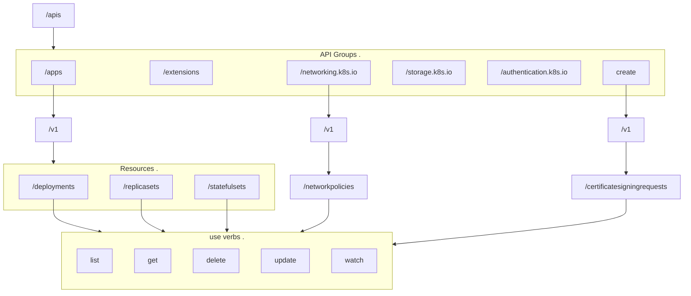

# There Is A Kubernetes Api Server
Check out the 
There are a bunch of endpoints that can be accessed at `curl https://kube-master-node-ip:6443/<many-endpoints>`:
- metrics
  - monitor health of cluster
- healthz
  - monitor health of cluster
- version
  - cluster version
- api
- apis
- logs
  - integrating with 3rd-party logging apps


- [There Is A Kubernetes Api Server](#there-is-a-kubernetes-api-server)
  - [Use Auth When requesting to the api](#use-auth-when-requesting-to-the-api)
    - [Note Differences Between Kube Proxy and Kubectl Proxy](#note-differences-between-kube-proxy-and-kubectl-proxy)
  - [Apis Responsible For Cluster Functionality](#apis-responsible-for-cluster-functionality)
  - [A Visual](#a-visual)


## Use Auth When requesting to the api
One option is to pass cert details to curl
```bash
curl https://localhost:6443 -k
  --key admin.key
  --cert admin.crt
  --cacert ca.crt
```

Another option is to use a built-in kubectl proxy client. This launches a proxy service on port 8001 && uses creds +certs from the default kubecconfig file. This way, keys + certs are not required for every api request
```bash
# setup the proxy
kubectl proxy
# starting to serve on 127.0.0.1:8001

curl https://localhost:8001 -k
# works!
```

### Note Differences Between Kube Proxy and Kubectl Proxy
The kubectl proxy is for api access.  
The Kube Proxy is a k8s object enabling connectivity between k8s objects in the k8s cluster.  

## Apis Responsible For Cluster Functionality
kubectl uses these apis under the hood, i think!

- `/api`
  - core group of apis
  - `/v1`
    - namespaces
    - events
    - bindings
    - configmaps
    - pods
    - endpoints
    - PV
    - secrets
    - rc
    - nodes
    - pvc
    - services
- `/apis`
  - apps
    - v1
      - deployments
        - list, get, create, delete, update, watch
      - replicasets
        - list, get, create, delete, update, watch
      - statefulsets
        - list, get, create, delete, update, watch
  - extensions
  - networking.k8s.io
    - v1
      - networkpolicies
  - storage.k8s.io
  - authentication.k8s.io
  - certificates.k8s.io
    - v1
      - certificatesigningrequests


## A Visual
The api resource url "hierarchy": 
