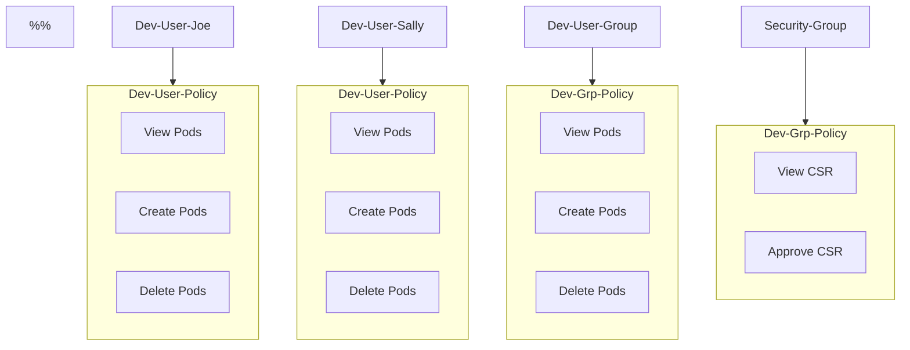
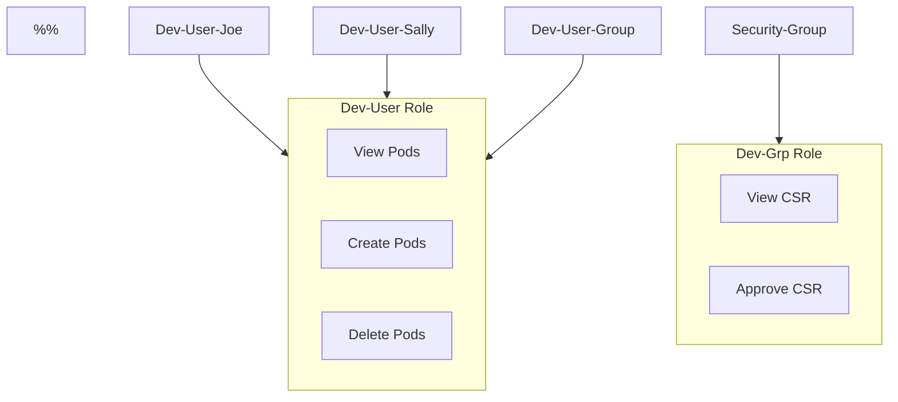

# Authorization in K8s
Admin users can do all kinds of stuff, potentially any operation.  
Other User Accounts can be made for other types of users. These can have restricted functions, so as to make sure specific users don't do things that they "shouldn't" be able to do, or need to do.   

- [Authorization in K8s](#authorization-in-k8s)
  - [Authorization On Objects](#authorization-on-objects)
    - [Internal Access of the K8s Cluster](#internal-access-of-the-k8s-cluster)
      - [Nodes](#nodes)
    - [External Access Outside of the Cluster](#external-access-outside-of-the-cluster)
    - [ABAC](#abac)
    - [RBAC](#rbac)
    - [WebHooks](#webhooks)
    - [Always](#always)
    - [Where Authorization Mode Config Lives](#where-authorization-mode-config-lives)
      - [Find the Authorization Modes](#find-the-authorization-modes)
  - [RBAC In More Depth](#rbac-in-more-depth)
    - [A Developer Role Example](#a-developer-role-example)
      - [Create The Role](#create-the-role)
        - [Config-First](#config-first)
        - [Imperative-First](#imperative-first)
      - [Bind The Role To A User](#bind-the-role-to-a-user)
        - [Imperative-First](#imperative-first-1)
  - [Cluster-Wide Objects ANd Cluster-Wide Roles](#cluster-wide-objects-and-cluster-wide-roles)
    - [ClusterRoles and ClusterRoleBindings](#clusterroles-and-clusterrolebindings)
  - [See my own access](#see-my-own-access)
  - [Access within the cluster](#access-within-the-cluster)
  - [Test a Users Capabilities](#test-a-users-capabilities)
## Authorization On Objects
### Internal Access of the K8s Cluster
#### Nodes
The Kubeapi server is accessed by folks, as well as by kubelet.  
These requests are handled by the node authoriser.  
There is a "system node" group that contains users that are authorized by the node authoriser.  

### External Access Outside of the Cluster 
There are a few auth mechanisms and "modes": abac, rbac, webhooks, alwaysAllow and alwaysDeny here.  
The modes are set using authorization-mode option on the kubeapi-server. It is default set to alwaysAllow. 
### ABAC
Users get associated with permissions: CRUD pods, etc.  
This is managed by a policy file.  
This file gets passed into the api server.  
ABAC are more difficult to manage than RBAC, and might require more manual updates to manage.  
Each user can get a policy file. Editing these policies require restarting the kubeapi server.  



A nuisance of this ABAC approach is that in order to update user access privileges requires updating files and restarting the apiserver. If many users have similar permissions, this requires many files being touched.

### RBAC
Wrap a bunch of permissions into a role.  
Assign roles to users - a developer role for developers, a security role for security users.  



The benefit of rbac over abac is that one role can apply to many users, so changing a bunch of user access rules can happen by editing a single role.  

### WebHooks
This is about "outsourcing" authz details to somehwere outside of k8s itself. K8s reaches out for authz details from a third party.  

OpenPolicyAgent is a tool that can help.  
K8s can "call" that agent, for info about a user, and get the users' authz deets.  

### Always
AlwaysAllow and AlwaysDeny are other authorization modes besides abac and rbac.  
The name says it all.  

### Where Authorization Mode Config Lives
This lives in the kube apiserver config file.
The default authorization mode of k8s is `AlwaysAllow`.  
The mode config can be updated in the kubeapi-server: `---authorization-mode=Node,RBAC,Webhook`.  
Multiple modes in the list mean that each request goes through each listed authz mode: First handled by the node authorizer (for node requests), RBAC checks, then webhooks. When one step is denied, the next is processed. When one succeeds, the authz process does not continue.  
#### Find the Authorization Modes
These are set as commands passed to a pod:
- the `kube-apiserver` pod, may be named something different
- the pod is "usually" in the `kube-system` namespace
- a bunch of "commands" get passed to the pod
```bash
# first command
kube-apiserver
# WITH a bunch of flags
      # ....
      --authorization-mode=Node,RBAC
      # ....
```

## RBAC In More Depth
### A Developer Role Example
#### Create The Role
##### Config-First
A new config file. Config for all!  

This could be called dev-role.yaml or something.
```yaml
apiVersion: rbac.authorization.k8s.io/v1
kind: Role
metadata:
  name: developer
rules:
- apiGroups: [""]
  resources: ["pods"]
  verbs: ["list", "get", "create", "update", "delete"]
- apiGroups: [""]
  resources: ["ConfigMap"]
  verbs: ["create"]
```
NOTE: resources can be specified:
```yaml
apiVersion: rbac.authorization.k8s.io/v1
kind: Role
metadata:
  name: webapp-developer
rules:
- apiGroups: [""]
  resources: ["pods"]
  verbs: ["list", "get", "create", "update", "delete"]
  resourceNames: ["webapp", "nginx"]
```
Create the role:
```bash
kubectl create -f dev-role.yaml
```

##### Imperative-First
Here, an imperative command to start the yaml file from a one-liner:
`kkc role --verb=list --verb=get --verb=create --resource=pods --dry-run=client -o yaml > dev-role.yaml`

#### Bind The Role To A User
Another config file.  
This could be called dev-to-role-binding.yaml
```yaml
apiVersion: rbac.authorization.k8s.io/v1
kind: RoleBinding
metadata:
  name: dev-to-role-binding
  # NOTE: can include namespace specifics here - default namespace is used when not specified
subjects:
# user details
- kind: User
  name: dev-user
  apiGroup: rbac.authorization.k8s.io
# role details
roleRef:
  kind: Role
  name: developer
  apiGroup: rbac.authorization.k8s.io
```
create it
```bash
kubectl create -f dev-to-role-binding.yaml
```

##### Imperative-First
Here, an imperative command to create a rolebinding with a user and a role in a nammespace:
`kkc rolebinding dev-user-binding --namespace=default --role=developer --user=dev-user`

See Roles & Bindings:
```bash
# see all roles
kubectl get roles

# see role bindings
kubectl get rolebindings

# more deets on a role
kubectl describe role developer

# more deets on a rolebinding
kubectl describe rolebinding dev-to-role-binding
```

## Cluster-Wide Objects ANd Cluster-Wide Roles
Many objects are namespace-scoped:
- pods
- replicasets
- jobs
- deployments
- services
- secrets
- roles
- rolebindings
- configmaps
- persistent volume claims

Some Objects are "broader" than a namespace, and more-so fit in the cluster scope:
- nodes
-  clusterroles
-  clusterrolebindings
-  certificatesigningrequests
-  namespaces
-  persistent volumes

### ClusterRoles and ClusterRoleBindings
allow actions on nodes, pvs, etc.  
K8s comes with cluster roles.  
Cluster Roles are not specific to a namespace - they are cluster-wide.  

Call this something like cluster-admin-role.yaml
```yaml
apiVersion: rbac.authorization.l8s.io/v1
kind: ClusterRole
metadata:
  name: cluster-administrator
rules:
- apiGroups: [""]
  resources: ["nodes"]
  verbs: ["list", "get", "create", "delete"]
```

Bind the role to a user with a culsterRoleBinding:
```yaml
apiVersion: rbac.authorization.kubernetes.io/v1
kind: ClusterRoleBinding
metadata:
  name: cluster-admin-role-binding
subjects:
- kind: User
  name: cluster-admin
  apiGroup: rbac.authorization.k8s.io
roleRef:
  kind: ClusterRole
  name: cluster-administrator
  apiGroup: rbac.authorization.k8s.io
```


## See my own access
```bash
# obeject then function
kubectl auth can-i create deployments
kubectl auth can-i delete pods

# as a user
kubectl auth can-i delete pods --as dev-user

# in a "horse" namespace
kubectl auth can-i delete pods --as dev-user --namespace horse
```


## Access within the cluster
- Kube ApiServer accessed by users
- Kube ApiServer accessed by kubelet on nodes
  - read + write info about k8s objects
  - handled by special authoriser: the node authorizor
  - kubelet should be part of the `system:node` group

## Test a Users Capabilities
`kkg pods --as <user-to-test-here>`, `kkg svc --as <user-to-test-here>`
That can be used to run a command AS A USER - that's one way of "testing" what kubectl commands "work" for a user - here the "get pods" command and the "get services" command.