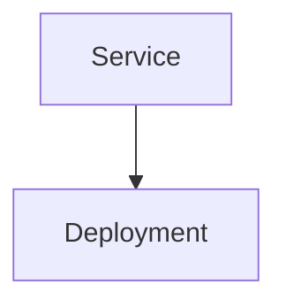
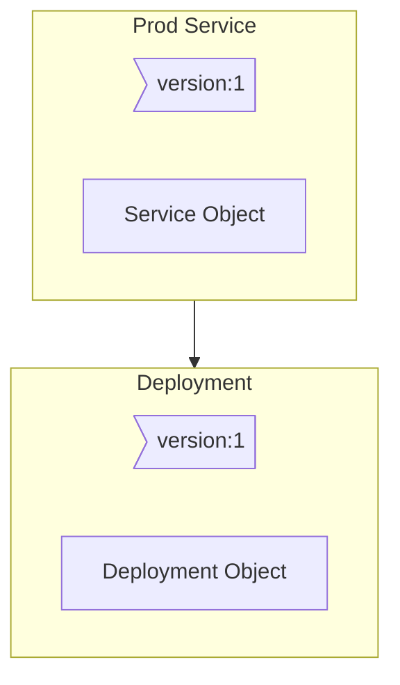
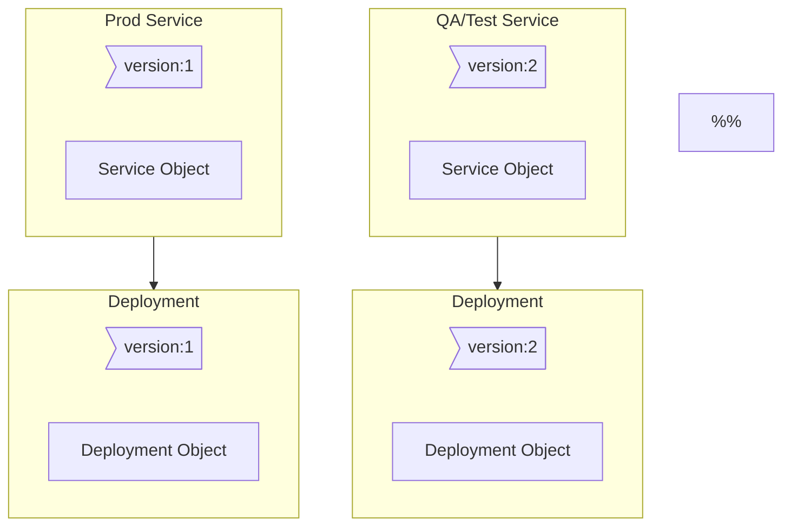

# Deploying Apps Through a Few Strategies
- [Deploying Apps Through a Few Strategies](#deploying-apps-through-a-few-strategies)
  - [Recreate with Downtime](#recreate-with-downtime)
  - [Rolling Update without Downtime](#rolling-update-without-downtime)
  - [Deploy Then Test Then Redirect Traffic With Blue-Green](#deploy-then-test-then-redirect-traffic-with-blue-green)
    - [Understand the Current state](#understand-the-current-state)
    - [Include labels to the Deployment and the service](#include-labels-to-the-deployment-and-the-service)
    - [Create A New Deployment With The New App Version](#create-a-new-deployment-with-the-new-app-version)
  - [Canary](#canary)

## Recreate with Downtime
First, destroy all existing versions of the app.  
Then, release new versions.  
Problem: App goes down during the process.  

## Rolling Update without Downtime
Take down 1 instance of the app at a time.  
App never goes down, better than recreate. This is the default in k8s :)  

## Deploy Then Test Then Redirect Traffic With Blue-Green
The new app gets deployed along-side the old one.  
Routing helps here - tests are run on the new version. Once tests pass, routing is redirected to the new app.  
Service Meshes can be helpful here.  

How does this work in K8s?

### Understand the Current state
  - a deployment of pods of the app is present
  - a service routing traffic to the pods is also present

### Include labels to the Deployment and the service
Here something like "version:1". Note the wrapper boxes here are just to "tie" the labels to the objects visually.  
The label on the deployment should also be included in the selector in the service definition file. This step can also be done when _creating the objects initially_: maybe including a `version: 1` on both the deployment and service to begin with.  

### Create A New Deployment With The New App Version
Deploy a new Deployment of the new version of the app.  
Have the deploymet accessible through a new service, accessible by some folks to test with, perphaps internal dogfooding or something.  

## Canary