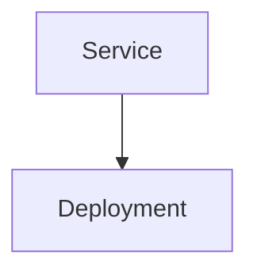
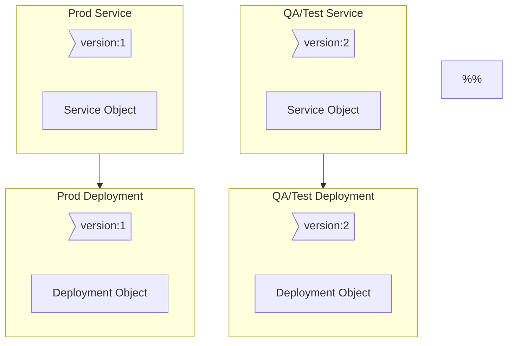
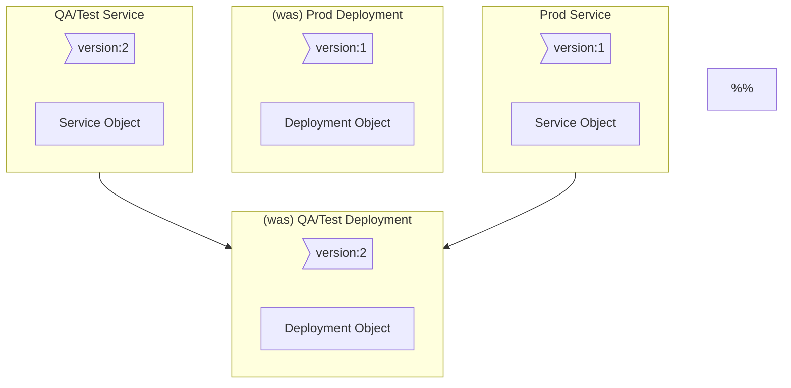

# Deploying Apps Through a Few Strategies
- [Deploying Apps Through a Few Strategies](#deploying-apps-through-a-few-strategies)
  - [Recreate with Downtime](#recreate-with-downtime)
  - [Rolling Update without Downtime](#rolling-update-without-downtime)
  - [Deploy Then Test Then Redirect Traffic With Blue-Green](#deploy-then-test-then-redirect-traffic-with-blue-green)
    - [Understand the Current state](#understand-the-current-state)
    - [Include labels to the Deployment and the service](#include-labels-to-the-deployment-and-the-service)
    - [Create A New Deployment With The New App Version](#create-a-new-deployment-with-the-new-app-version)
    - [Adjust the Label Selector on the Production Service](#adjust-the-label-selector-on-the-production-service)
    - [See This In Code](#see-this-in-code)
      - [App Deployment Def V1](#app-deployment-def-v1)
      - [App Service Def V1](#app-service-def-v1)
      - [App Deployment Def V2](#app-deployment-def-v2)
      - [Change Label On Service Def](#change-label-on-service-def)
  - [Canary](#canary)

## Recreate with Downtime
First, destroy all existing versions of the app.  
Then, release new versions.  
Problem: App goes down during the process.  

## Rolling Update without Downtime
Take down 1 instance of the app at a time.  
App never goes down, better than recreate. This is the default in k8s :)  

## Deploy Then Test Then Redirect Traffic With Blue-Green
The new app gets deployed along-side the old one.  
Routing helps here - tests are run on the new version. Once tests pass, routing is redirected to the new app.  
Service Meshes can be helpful here.  

How does this work in K8s?

### Understand the Current state
  - a deployment of pods of the app is present
  - a service routing traffic to the pods is also present



### Include labels to the Deployment and the service
Here something like "version:1". Note the wrapper boxes here are just to "tie" the labels to the objects visually.  
The label on the deployment should also be included in the selector in the service definition file. This step can also be done when _creating the objects initially_: maybe including a `version: 1` on both the deployment and service to begin with.  


### Create A New Deployment With The New App Version
Deploy a new Deployment of the new version of the app.  
Have the deploymet accessible through a new service, accessible by some folks to test with, perphaps internal dogfooding or something.  



### Adjust the Label Selector on the Production Service
Tell the Production service to matchLabels for the new version.  
This will leave...
- the qa service talking to the qa/latest instance of the app stil
- the prod service talking to the latest instance of the app
- the previous deployment of the app "dangling" without incoming traffic



### See This In Code
#### App Deployment Def V1
```yaml
apiVersion: apps/v1
kind: Deployment
metadata:
  name: webapp-deployment
  labels:
    app: webapp
    type: frontend
spec:
  replicas: 3
  selector:
    matchLabels:
      version: 1
  template:
    metadata:
      name: webapp-pod
      labels:
        version: 1
    spec:
      containers:
        - name: webapp-box
          image: web-api:1
```

#### App Service Def V1
```yaml
apiVersion: v1
kind: Service
metadata:
  name: webapp-service
spec:
  selector:
    version: 1
```

#### App Deployment Def V2
This would be the new version of the deployment.  
Here, Colors can be used to decipher the deployments from one-another. ROYGBIV might be useful for matching colors to objects in "order".  
The differences here from the first version are:
- the dpeloyment name
- the deployment selector label value
- the pod label
- the container image version


```yaml
apiVersion: apps/v1
kind: Deployment
metadata:
  name: webapp-deployment-green
  labels:
    app: webapp
    type: frontend
spec:
  replicas: 3
  selector:
    matchLabels:
      version: 2
  template:
    metadata:
      name: webapp-pod
      labels:
        version: 2
    spec:
      containers:
        - name: webapp-box
          image: web-api:2
```

#### Change Label On Service Def
Same file as v1 above, just a new `spec:selector:version` value.  

```yaml
apiVersion: v1
kind: Service
metadata:
  name: webapp-service
spec:
  selector:
    version: 2
```

## Canary