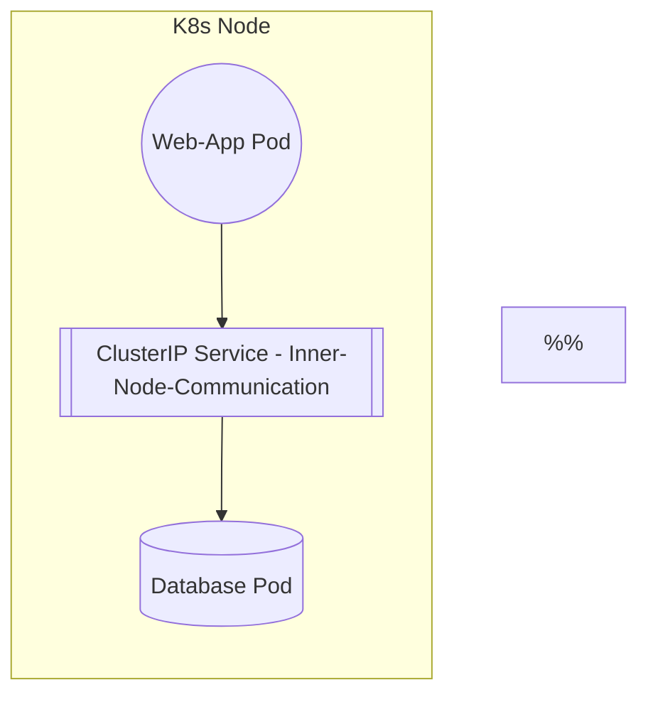
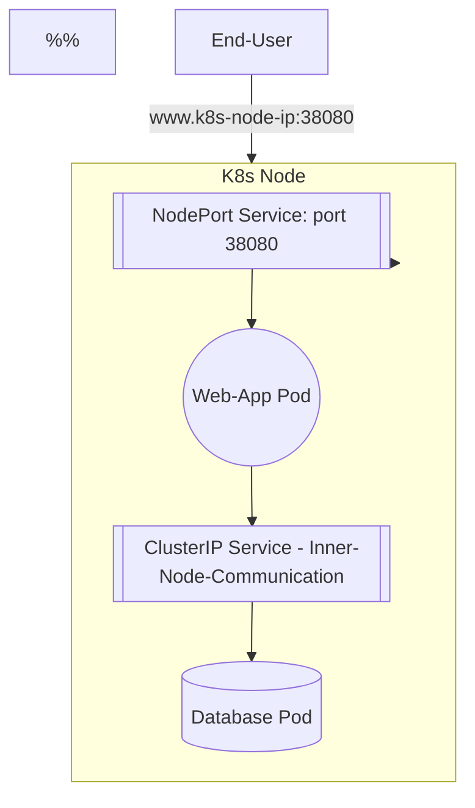
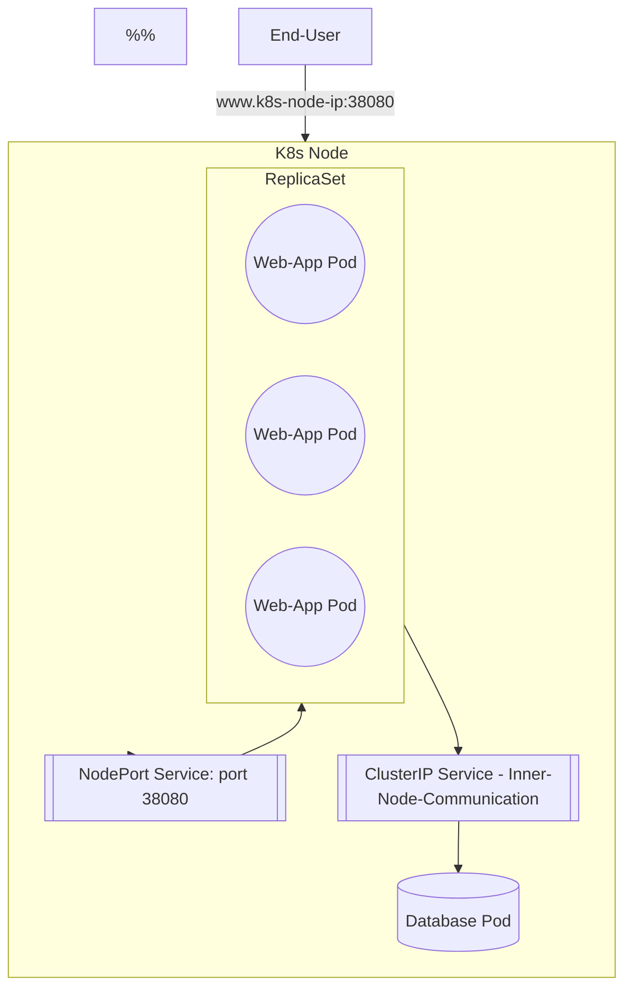
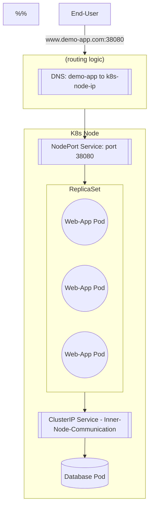
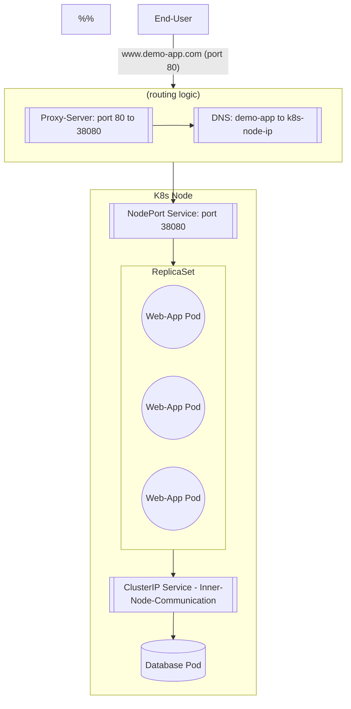
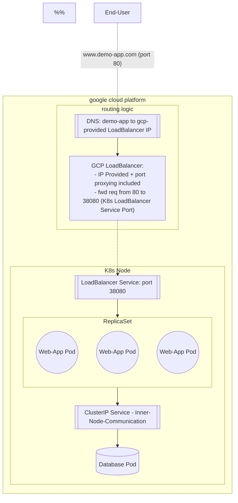

# Ingress

## Consider a Mock App Example
### An App
An app, maybe an online e-commerce platform.  
Build it into a docker img.  
Deploy it on a K8s Pod, in a K8s Deployment object.  

### A DB And A Service To Allow the Two to Talk
The db needs a db, so a db gets built.  
A new Pod gets deployed on the same node.  
The App pod needs to talk to the db, so a new K8s service gets created to allow this pod-to-pod communication.  

### Make it Available with a NodePort Service
Another service is made, a NodePort service, that opens the app to the world via a url+port, at something like http://<the-k8s-node-ip>:<the-nodePort-port>.  

### Address App Scaling Needs With ReplicaSets
Once Traffic gets busy enough, build a ReplicaSet to scale the App pods. the NodePort service will split traffic between the replicated pods.  

### Allow For Friendly URL with DNS Config
Configure the dns server in use to redirect `my-demo-app.com` to `<the-k8s-node-ip>`. Now, users can access the app at http://my-demo-app.com:<the-nodePort-port>`.  

### Remove the Need For the Port in the URL with A Proxy Server
Configure a proxy-server to sit between the world and the DNS, so that the world can access the url without the port.  
The Proxy server will forward port 80 (_open ot the world_) to the nodePort service port.  

### Host K8s In A Cloud Platform
Take GCP as an example. A few things get updated:
- the NodePort service can be converted to a `LoadBalancer` service type, which ...
  - allows NodePort service details to exist (_make the node available through a port_)
  - K8s sends req to GCP to provision a network load-balancer for the service: where GCP deploys a load-balancer to split traffic across multiple nodes (_if that ever happens_)
  - the GCP load-balancer comes with an external ip
- The DNS needs to be updated to change my-app-url to the gcp-ip-addr

