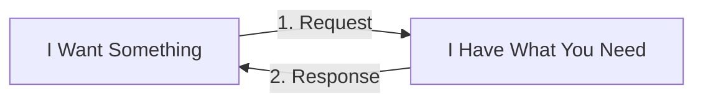
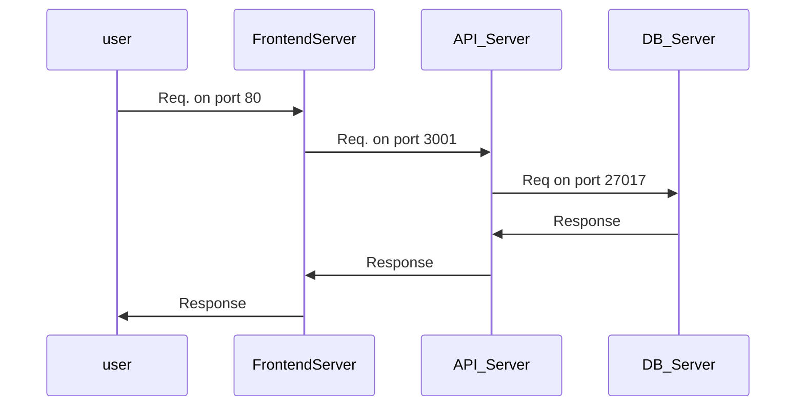

# Network Traffic Is Though Of From Where The Request Starts
In a traditional http data-transfer, each request has 2 parts: a request and a response. One unit makes a request to another unit, and the other unit fullfills the request and the http data-transfer "comes back" to the initial requester.  



- [Network Traffic Is Though Of From Where The Request Starts](#network-traffic-is-though-of-from-where-the-request-starts)
  - [Kubernetes default allow-all policy](#kubernetes-default-allow-all-policy)
  - [A 3-Pod Networking Example](#a-3-pod-networking-example)
    - [Ingress and Inbound traffic](#ingress-and-inbound-traffic)
    - [Egress and Outbound Traffic](#egress-and-outbound-traffic)
    - [Ingress and Egress as Rules](#ingress-and-egress-as-rules)
      - [Frontend Server](#frontend-server)
      - [API Server](#api-server)
      - [DB](#db)
    - [Ingress, Pods, and Services Through Network Policies](#ingress-pods-and-services-through-network-policies)
  - [Network Policies are Enforced by the networking solutions](#network-policies-are-enforced-by-the-networking-solutions)

## Kubernetes default allow-all policy
Kubernetes applies an "allow-all" networking policy between objects.  
Network policies are used to restrict network activity to & from k8s objects.   

## A 3-Pod Networking Example
3 Servers. Example Ports. What happens when the users wants to use a page that gets data from a db through an api:  



### Ingress and Inbound traffic
Ingress and Egress notes specifically about where dataflow _starts_.  
**Ingress** referrs to inbound traffic, like how ...
- **the frontend** server recieves ingress traffic from the user
- **the api** server recieves ingress traffic from the frontend server
- - **the db** recieves ingress traffic from the api server

### Egress and Outbound Traffic
Egress represents an object _making an outbound request_, like how...
- **the frontend** server creates egress traffic to the api
- **the api** server creates egress traffic to the db


### Ingress and Egress as Rules
Here, ingress and egress traffic are describes by each object in this 3-object diagram in 6 bullet points.  
These rules will translate to the K8s world.  
Also notice - indirectly, the frontend does not "need" to talk to the db server. 

#### Frontend Server
- allow ingress on port 80 from the world
- allow egress on port 5000 to the api pod

#### API Server
- allow ingress on port 5000 from the frontend server
- allow egress on port 27017 to the db 

#### DB
- allow ingress on port 27017 from the api server


### Ingress, Pods, and Services Through Network Policies
Here, a look at the db networking policy details:
```yaml
policyTypes: 
- Ingress
ingress:
- from:
  - podSelector:
      matchLabels:
        name: api-pod
  ports:
    - protocol: TCP
      port: 27017
```

in context of a more complete network policy def file:
```yaml
# db-policy.yaml
apiVersion: networking.k8s.io/v1
kind: NetworkPolicy
metadata:
  name: db-network-policy
spec:
  podSelector:
    matchLabels:
      role: db
  policyTypes: 
  - Ingress
  ingress:
  - from:
    - podSelector:
        matchLabels:
          name: api-pod
    ports:
      - protocol: TCP
        port: 27017
```

`kubectl create -f db-policy.yaml`

## Network Policies are Enforced by the networking solutions
[K8s Has more docs on the details](https://kubernetes.io/docs/tasks/administer-cluster/network-policy-provider/):  
| SUPPORTING network policies | NOT supporting network policies |
|:--|:--|
|[Kube-router](https://www.kube-router.io/)|Flannel|
|[Calico](https://projectcalico.docs.tigera.io/getting-started/kubernetes/)||
|[Romana](https://kubernetes.io/docs/tasks/administer-cluster/network-policy-provider/romana-network-policy/)||
|[weave-net](https://www.weave.works/docs/net/latest/kubernetes/kube-addon/)||
|Antrea||
|Cilium||