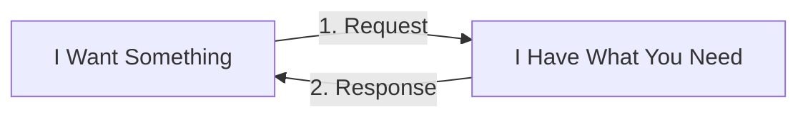

# Network Traffic Is Though Of From Where The Request Starts
In a traditional http data-transfer, each request has 2 parts: a request and a response. One unit makes a request to another unit, and the other unit fullfills the request and the http data-transfer "comes back" to the initial requester.  

