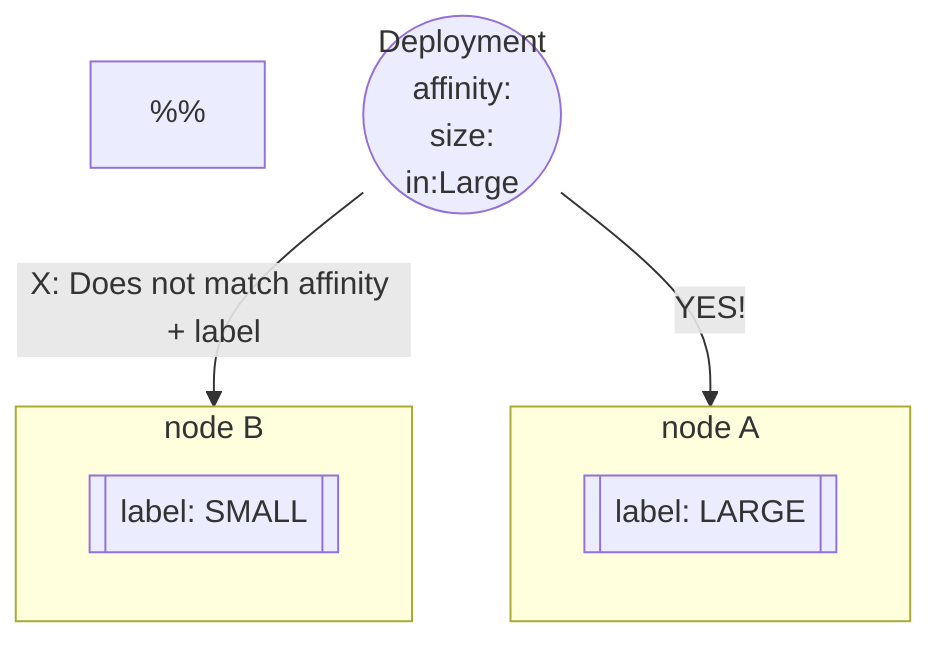

# Node Affinity  
Node Affinity help match pods to nodes more flexibly than node selectors.  

- [Node Affinity](#node-affinity)
  - [Match Pods to Any Nodes With Matching Node Label Values](#match-pods-to-any-nodes-with-matching-node-label-values)
  - [Match Pods to Any Nodes Without a Specific Label Value](#match-pods-to-any-nodes-without-a-specific-label-value)
  - [Match Pods to Any Nodes With a Specific Label Present](#match-pods-to-any-nodes-with-a-specific-label-present)
  - [NodeAffinity Types](#nodeaffinity-types)
    - [An Affinity Table](#an-affinity-table)
  - [Combining Taints, Tolerations, and NodeAffinity](#combining-taints-tolerations-and-nodeaffinity)
  - [Things To Be Able To Do](#things-to-be-able-to-do)
  - [A Visualization](#a-visualization)
  - [A Deployment Definition WIth NodeAffinity](#a-deployment-definition-with-nodeaffinity)


Set a label on a node:
```bash
# kubectl label nodes <node-name> key=val
kubectl label nodes this-node size=large
```

## Match Pods to Any Nodes With Matching Node Label Values  
Set a nodeAffinity in a pod def file. Here, the pod can be put on a node where the "size" label is either "large" or "medium"  

```yaml
apiVersion: v1
kind: Pod
metadata:
  name: pod
spec:
  containers:
    - name: horse
      image: horse
  # THIS
  affinity:
    nodeAffinity:
      requiredDuringSchedulingIgnoredDuringExecution:
        nodeSelectorTerms:
          - matchExpressions:
            - key: size
              operator: In
              values:
                - large
                - medium
```

## Match Pods to Any Nodes Without a Specific Label Value
Another example of a pod def file, where the nodeAffinity expresses that the pod will deploy on any node where the "size" label is not "small"
```yaml
apiVersion: v1
kind: Pod
metadata:
  name: pod
spec:
  containers:
    - name: horse
      image: horse
  # THIS
  affinity:
    nodeAffinity:
      requiredDuringSchedulingIgnoredDuringExecution:
        nodeSelectorTerms:
          - matchExpressions:
            - key: size
              operator: NotIn
              values:
                - small
```  

## Match Pods to Any Nodes With a Specific Label Present
Another example of a pod def file, where the nodeAffinity expresses that the pod will be deployed on any node where the "size" label exists.  
Note: on the node, a label will be present that looks like `size=`. This means that 
- the label key is PRESENT
- the size label has not set value

```yaml
apiVersion: v1
kind: Pod
metadata:
  name: pod
spec:
  containers:
    - name: horse
      image: horse
  # THIS
  affinity:
    nodeAffinity:
      requiredDuringSchedulingIgnoredDuringExecution:
        nodeSelectorTerms:
          - matchExpressions:
            - key: size
              operator: Exists
```  

## NodeAffinity Types
There are 2 stages of the pod lifecycle that the affinity cares about:
- during scheduling
  - a pod doesnt exist yet
- during execution 

- **requiredDuringSchedulingIgnoredDuringExecution** 
  - the affinity rule must be met for the pod to be deployed
  - the pod will continue to run on a node if the node label changes
- **preferredDuringSchedulingIgnoredDuringExecution**
  - the pod will be deployed even if a node with a matching label is not present
  - the pod will continue to run on a node if the node label changes

### An Affinity Table
||DuringScheduling|DuringExecution|
|:--|:--:|:--:|
|Type1|Required|Ignored|
|Type2|Preferred|Ignored|

## Combining Taints, Tolerations, and NodeAffinity
Say a team has 3 pods named fish, dog, and cat.  
There are other teams with pods.  
The team shares 3 nodes with other teams. There a 5 nodes total.  
A goal here could be to assure that our 3 pods get deployed in a specific way
- 1 pod per node
- always deploy the same pod to the same node
- do not allow other teams' pods to be deployed onto our 3 nodes
How?!
- taint the nodes to NOT allow other people's pods onto our 3 desired nodes
- add labels to our nodes
- add nodeAffinity rules to our pods to match the pods to nodes for specific deployments

## Things To Be Able To Do
1. get the number of labels on a node
2. add a label to a running node
3. create a deployment
  - named blue
  - with a postgres image
  - 3 replicas
4.  check which nodes will allow pods to be deployed on them, inspecting node taints
5. adjust nodeAffinity of a deployment
6. create a deployment so that the pods get deployed on a specific node, using pod nodeAffinity specs
```bash
# 1
kubectl describe nodes node-name --showlabels

# 2
# kubectl label nodes node-name labelName=labelValue
kubectl label nodes horse wild=mustang

# 3
kubectl create deployment blue --image=nginx --replicas=3

# 5
# get the deployment
kubectl get depolyments <deployment-name> -o yaml > asdf.yaml
# adjust the deployment config
# delete the running deploymet
# re-deploy the deployment
kubectl create -f asdf.yaml
# may need to wait 
```

## A Visualization


## A Deployment Definition WIth NodeAffinity
NOTE: When building a deployment definition file, the nodeAffinity goes in `spec.template.spec.<here>`.  
Here, an api deployment is intended to go on a specific node...   

```yaml
apiVersion: apps/v1
kind: Deployment
metadata:
  name: dep-with-affinity
spec:
  replicas: 3
  selector:
    matchLabels:
      app: rest-api
  #  pod templates nested
  #  includes nested metadata & spec
  template:
    metadata:
      labels:
        app: rest-api
    spec:
      # HERE! is the affinity
      affinity:
        nodeAffinity:
          requiredDuringSchedulingIgnoredDuringExecution:
            nodeSelector:
            - matchExpressions:
              - key: node_type
                operator: In
                values:
                - api_friendly
      # ... the rest of the pod definition
      containers:
      - name: api-box
        image: homegrownimage:1.2.3 
```