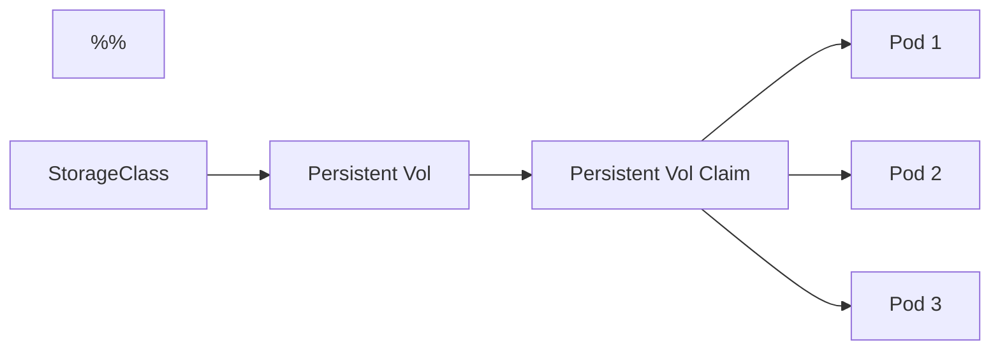
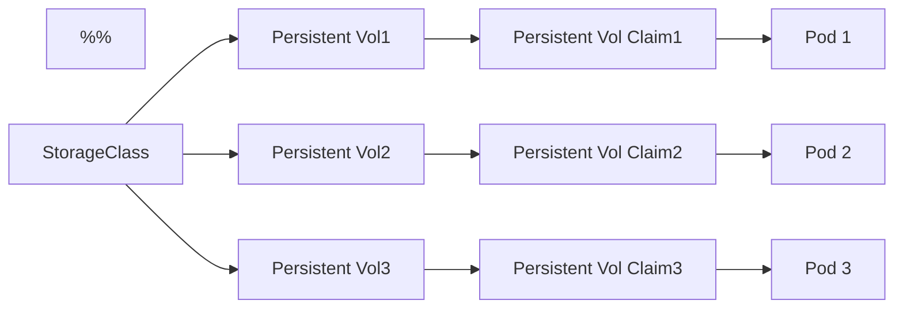

# Stateful Sets Are Similar To Deployments
Deployments can manage replicas of pods.  
Stateful sets can too.  
Stateful sets, though, ["maintain a sticky identifier"](https://kubernetes.io/docs/concepts/workloads/controllers/statefulset/) for each of the pods that the set "watches over".  

## May Not Be Needed
["_If an application doesn't require any stable identifiers or ordered deployment, deletion, or scaling, you should deploy your application using a workload object that provides a set of stateless replicas_"](https://kubernetes.io/docs/concepts/workloads/controllers/statefulset/#using-statefulsets). Go to Deployments or ReplicaSets instead.  

## Consider Stateful Sets For Something Like DB Replicaion
Consider starting with a single server. 
- install a db on the server and get it working
- to withstand failures, replica sets may get deployed onto several new servers

Build a few new servers.  
- a master server dataset gets replicated to other "slave" servers
- application workloads go to the master server
- the master db node "knows about" which slave node has the replica data on it
  - **the issue here** is that in K8s land, without stateful sets, this is impossible due to the ephemeral nature of pods

With StatefuSets, pods are...
- created in a sequential order - master could be spun up first, then slave 1, then slave 2
- assigned indexes, 0-first, by the stateful set
- get unique names (db-0, db-1, db-2, etc)
  - **these names can be relied on!!**
- given a stable, unique dns record that any app can use to access the pod

Scaling can be helped here because new pods are cloned from previous instances.  
Also, on pod termination, the latest pod is deleted first.  

## Definition file
This is similar to a deployment definition file.  

```yaml
# ss.yaml
apiVersion: apps/v1
kind: StatefulSet
metadata:
  name: db-set
  labels:
    app: db
spec:
  replicas: 3
  selector:
    matchLabels:
      app: db
  template:
    metadata:
      labels:
        app: db
      spec:
        containers:
          - name: mongodb
            image: mongodb:5
  # unique to StatefulSets, not deployments
  serviceName: mongodb-h
```

## Storage in Stateful Sets
### All pods share the same vol
Here, all pods in the stateful set will try to use the same volume:
```yaml
apiVersion: apps/v1
kind: StatefulSet
metadata:
  name: db-ss
  labels:
    app: db
spec:
  replicas: 3
  selector:
    matchLabels:
      app: db
  # pod def template section
  template:
    metadata:
      labels:
        app: db
    spec:
      containers:
      - name: mongodb
        image: mongodb:5
        volumeMounts:
        - mountPath: /data-root-dir-i-forgot
          name: db-vol
      volumes:
      - name: db-vol
        persistentVolumeClaim:
          claimName: db-vol-claim
```


### Each Pod Gets Its Own PVC + PV
Here, a stateful set can deploy pods that each reference their own pvc, which each is bound to their own pv. Here, what looks nearly identical to a pvc definition file gets added to the statefulset def file under `spec.volumeClaimTemplates`. Note:
- stateful set creates the first pod
  - A Pvc is created for each pod
  - the pvc is connected to a storageClass
  - the storageClass provisions a vol on the storage provider, here google
  - the storageClass creates a pv
  - the storageClass binds the pv to the pvc
- those steps repeat for each pod in the replica set, in order
- **stateful sets** dont delete pvcs during pod failure/recreation - stateful sets maintain "stable storage" for pods

```yaml
apiVersion: apps/v1
kind: StatefulSet
metadata:
  name: db-ss
  labels:
    app: db
spec:
  replicas: 3
  selector:
    matchLabels:
      app: db
  # pod def template section
  template:
    metadata:
      labels:
        app: db
    spec:
      containers:
      - name: mongodb
        image: mongodb:5
        volumeMounts:
        - mountPath: /data-root-dir-i-forgot
          name: db-vol
  volumeClaimTemplates:
  - metadata:
      name: db-vol
    spec:
      accessModes:
        - ReadWriteOnce
      storageClassName: google-storage
      resources:
        requests:
          storage: 500Mi
```

