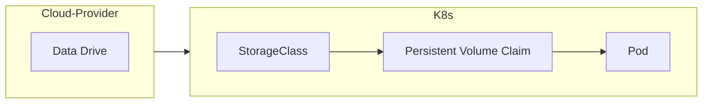

# Define a Data-Storage Solution Dynamically with Storage Classes

- [Define a Data-Storage Solution Dynamically with Storage Classes](#define-a-data-storage-solution-dynamically-with-storage-classes)
  - [Leverage StorageClasses To Consume Data Resources Before Data Resources Are Available](#leverage-storageclasses-to-consume-data-resources-before-data-resources-are-available)
  - [A Pod With A Persistent Volume Claim](#a-pod-with-a-persistent-volume-claim)
    - [Pod Definition](#pod-definition)
    - [PVC Definition](#pvc-definition)
    - [PV Definition](#pv-definition)
  - [Migrating to a Storage Class Solution](#migrating-to-a-storage-class-solution)
    - [Storage Class Definition](#storage-class-definition)
    - [Adjust the Persistent Volume Claim to Point To The Storage Class](#adjust-the-persistent-volume-claim-to-point-to-the-storage-class)
  - [Data Volume Provisioners](#data-volume-provisioners)
  - [Other Storage Class Parameter To Consider](#other-storage-class-parameter-to-consider)
  - [An Example, Leveraging An NFS Mount](#an-example-leveraging-an-nfs-mount)
    - [The PV Definition](#the-pv-definition)
    - [The PVC Def](#the-pvc-def)
- [An Example, StorageClasses By "Tier"](#an-example-storageclasses-by-tier)
  - [Bronze](#bronze)
  - [Silver](#silver)
  - [Gold](#gold)


## Leverage StorageClasses To Consume Data Resources Before Data Resources Are Available
**With Persistent Volumes**, a data-storage **disk** must be created prior to creating the Persistent Volume.  
This is **static provisioning**.  

**With Storage Classes**, though, and **dynamic provisioning**
- a data provisioner can be made (_like google or amazon or whatever_)
- the provisioner can _automatically create storage_ and attach the storage to pods when a claim is made.  
- StorageClasses allow for external storage providers, like GCE, Amazon, or others to create the disk



A StorageClass Def File:  
```yaml
apiVersion: storage.k8s.io/v1
kind: StorageClass
metadata:
  name: gcp-storage
provisioner: kubernetes.io/gce-pd
```  

## A Pod With A Persistent Volume Claim
Here's an example of a pod that uses a volume. The volume, here, is a persistent Volume. Here,
- the pod definition 
  - includes a volume mount set of args for the container
  - includes a volume description inside the spec
  - includes a reference to the persistent volume claim (_pvc_) name
- the pvc definition
  - has a name in the metadata, used by the pod above
  - has an accessMode and storage amount, where both are like requested attrs to the Persistent Volume (_pv_) gods
- the pv definition
  - has an accessMode and capacity:storage which both allow for the prior pvc def file to "work" with this pv definition

### Pod Definition
```yaml
# pod.yaml
apiVersion: v1
kind: Pod
metadata:
  name: rando-num-gen
spec:
  containers:
  - image: alpine
    name: alpine
    command: ["/bin/sh","-c"]
    args: ["shuf -i 0-100 -n 1 >> /opt/rando.txt"]
    volumeMounts:
      - mountPath: /opt
        name: opt-vol
  volumes:
  - name: opt-vol
    persistentVolumeClaim:
      claimName: my-pvc
```

### PVC Definition
```yaml
# pvc.yaml
apiVersion: v1
kind: PersistentVolumeClaim
metadata:
  name: my-pvc
spec:
  accessModes:
    - ReadWriteOnce
  resources:
    requests:
      storage: 500Mi
```
### PV Definition
```yaml
# pv.yaml
apiVersion: v1
kind: PersistentVolume
metadata:
  name: pv-a
spec:
  accessModes:
    - ReadWriteOnce
  capacity:
    storage: 500Mi
  gcePersistentDisk:
    pdName: pd-disk
    fsType: ext4
```

## Migrating to a Storage Class Solution
To Migrate from a PVC to a storage class..
- a storageClass def file needs to be created
- the pv def can be removed, in place of the storage class
  - the pv still gets created - rather than manually with a def file, through the storage class
- the pvc needs to reference the storage class instead of the pv

### Storage Class Definition
```yaml
apiVersion: storage.k8s.io/v1
kind: StorageClass
metadata:
  name: gce-storage-class
provisioner: kubernetes.io/gce-pd
```

### Adjust the Persistent Volume Claim to Point To The Storage Class
```yaml
# pvc.yaml
apiVersion: v1
kind: PersistentVolumeClaim
metadata:
  name: my-pvc
spec:
  accessModes:
    - ReadWriteOnce
  # storageClass adjustment/addition here!!
  storageClassName: google-storage
  resources:
    requests:
      storage: 500Mi
```

## Data Volume Provisioners
There are many providers for data volumes:
 - AWSElasticBlockStore
 - AzureFile
 - AzureDisk
 - CephFS
 - Cinder
 - FC
 - FlexVolume
 - Flocker
 - GCEPersistentDisk
 - Glusterfs
 - ISCSI
 - Quobyte
 - NFS
 - RBD
 - VshpereVolume
 - PortworxVolume
 - ScaleIO
 - StorageOS
 - Local
(_more or less_)

## Other Storage Class Parameter To Consider
Disk Type, replication Type, etc.  
One in particular is the `VolumeBindingMode`.  
This affects how the thing "works".  
As an example, the `waitForFirstConsumer` option means that a pvc connected to a pv _without a pod_ will set the pvc to `available` and the pvc doesn't mount to the pv.  
A pod consuming the pvc must be created in order for the pvc+pv to marry.

## An Example, Leveraging An NFS Mount
For Background
- one node (i.e the controlplane node) has an nfs server built into the node, making some directories & files available through nfs
- another node (i.e a worker node), with expected nfs tooling installed, should be able to access the controlplanes node
### The PV Definition
```yaml
apiVersion: v1
kind: PersistentVolume
metadata:
  name: pvvol-1
spec:
  capacity:
    storage: 1Gi
  accessModes:
  - ReadWriteMany
  persistentVolumeReclaimPolicy: Retain
  nfs:
    # the shared path from the nfs server
    path: /opt/sfw
    # the NAME or the IP of the controlplane node here
    server: controlplanenode
    readOnly: false
```

### The PVC Def
```yaml
apiVersion: v1
kind: PersistentVolumeClaim
metadata:
  name: nfs-pvc
spec:
  accessModes:
  # match the pv, don't forget!
  - ReadWriteMany
  resources:
    requests:
      storage: 200Mi
```

# An Example, StorageClasses By "Tier"
Here, 3 "tiers" of storage class could be developed, with varying attributes to "match" the tier. Then, some less-cumbersome language can be used to describe the storage obejcts (_bronze, silver, and gold_).  
## Bronze
A standard disk.  
```yaml
apiVersion: storage.k8s.io/v1
kind: StorageClass
metadata:
  name: gce-storage-class
provisioner: kubernetes.io/gce-pd
parameters:
  type: pd-standard
  replication-type: none
```
## Silver
An SSD Drive.  
```yaml
apiVersion: storage.k8s.io/v1
kind: StorageClass
metadata:
  name: gce-storage-class
provisioner: kubernetes.io/gce-pd
parameters:
  type: pd-ssd
  replication-type: none
```
## Gold
An SSD with replication.  
```yaml
apiVersion: storage.k8s.io/v1
kind: StorageClass
metadata:
  name: gce-storage-class
provisioner: kubernetes.io/gce-pd
parameters:
  type: pd-ssd
  replication-type: regional-pd
```