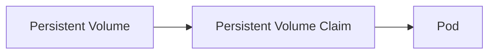
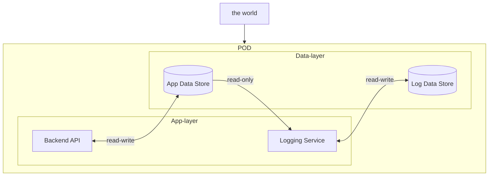

# Volumes
Volumes are directories.  
Volumes can be shared between many pods/containers. One Container can access many pods. its a many-to-many potential.  
Data corruption, due to many pods writing, can happen. Ugh.  

- [Volumes](#volumes)
  - [Volumes in Docker](#volumes-in-docker)
    - [Volumes in K8s](#volumes-in-k8s)
      - [Volumes Have Access Modes](#volumes-have-access-modes)
  - [A Workflow For Creating a Volume to Persist Data Of A Pod](#a-workflow-for-creating-a-volume-to-persist-data-of-a-pod)
  - [A Trivial Pod With A Volume Attached](#a-trivial-pod-with-a-volume-attached)
  - [Volume Data-Storage Options](#volume-data-storage-options)
    - [A Host Path](#a-host-path)
    - [Other Options](#other-options)
- [Introduce Volumes At Scale With Persistent Volumes](#introduce-volumes-at-scale-with-persistent-volumes)
  - [Pod-Defined Volumes May Not Be Scalable](#pod-defined-volumes-may-not-be-scalable)
  - [Persistent Volumes Make Volume Definition Simpler Across Pods](#persistent-volumes-make-volume-definition-simpler-across-pods)
  - [Persistent Volume Definition Example](#persistent-volume-definition-example)
- [Consume Persistent Volumes with Persistent Volume Claims](#consume-persistent-volumes-with-persistent-volume-claims)
  - [A PVC Def File](#a-pvc-def-file)
  - [Delete a PVC](#delete-a-pvc)
  - [Apply a PVC To A Pod](#apply-a-pvc-to-a-pod)
  - [Volume Types In More Depth](#volume-types-in-more-depth)
- [References](#references)
  - [Random Take-Aways](#random-take-aways)
  - [A Diagram](#a-diagram)


## Volumes in Docker
  - **containers** are transient: lasting only as long as they are needed
  - **data** in containers gets destroyed
  - **volumes** can be attached to containers to retain data when the container is deleted

### Volumes in K8s
  - **pods are transiet** - like containers
  - **volumes** can be attached to a pod
There are over 20 volume types: NFS, rgb, cloud-provided types - each with a specific set of config details.  
The Cluster groups & sorts the volumes, grouped by access mode and sorted by vol size, from small to big.  

#### Volumes Have Access Modes
Volumes Can either be
- ReadWriteOnce (RWO)
  - allows read-write by a node
- ReadWriteMany (RWX)
  - allows read-write by many nodes
- ReadOnlyMany (ROX)
  - allows read-only by many nodes

This mode must Match or be "greater" between the PV and the PVC.  


## A Workflow For Creating a Volume to Persist Data Of A Pod
- ID the data persistence needs of the pod
  - what data needs to be persisted after the container + pod are destroyed?
  - where does the container/pod "think" it is writing data to, currently?

## A Trivial Pod With A Volume Attached
An alpine container.  
Has a built-in command with args on startup.  
Creates a rando number && sends the result to a file, `/opt/number.out`.  

```yaml
apiVersion: v1
kind: Pod
metadata:
  name: rando-num-gen
spec:
  containers:
    - image: alpine
      name: alpine-pod
      command: ["/bin/sh", "-c"]
      args: ["shuf -i 0-100 -n 1 >> /opt/number.out;"]
      # associate the volume, below, with this container
      volumnMounts:
      # the "container" directory
      - mountPath: /opt
        # the volume name
        name: rando-gen-vol
        

  # THE VOLUME! PERSIST THE DATA!
  # a sibling of the "containers" key
  volumes:
  - name: rando-gen-vol
    # use a dir on the host, the "/data" dir
    hostPath:
      path: /data
      type: Directory
```

## Volume Data-Storage Options
### A Host Path
Configure a directory on the host as storage space for a volume.  
```yaml
  volumes:
  - name: the-volume-friendly-name-to-reference-in-the-container-def
    # use a dir on the host, here the "/data" dir
    hostPath:
      path: /data
      type: Directory
```
**This works well** for single nodes.  
**This does not work well** for multi-node clusters.  
Many `/data` dirs, one per node, would be used. This might not be what the goal is.  

### Other Options
- NFS
- GluserFS
- Flocker
- Ceph
- Scaleio
- AWS, EBS - elastic block store volume
- Azure Disk
- Googles Persistent Disk


# Introduce Volumes At Scale With Persistent Volumes
Persistent Volumes, along with Persistent Volume Claims, allow things like pods to "talk to" a persistent volume object. Data that a pod might create (logs, etc.) can be stored in the persistent volume. The Persistent volume can be "bound" to objects like pods.
## Pod-Defined Volumes May Not Be Scalable
Volume Config _can happen in a pod definition file_, as in the above work.  
With a large env, **this does not scale well.** If many folks are creating pod def files, users will be required to include what seems like redundant config detailing in order to leverage a volume.  

## Persistent Volumes Make Volume Definition Simpler Across Pods  
A PV is a cluster-wide pool of vols, config'd by an admin, to be used by users deploying apps on the cluster.  
Users can select storage using a Persistent Volume Claim (PVC).  

## Persistent Volume Definition Example
```yaml
apiVersion: v1
kind: PersistentVolume
metadata:
  name: pv-one
spec:
  accessModes:
    - ReadWriteOnce
  capacity:
    storage: 1Gi
  # the 'hostPath:path' option may not be nest in a prod en    
  # hostPath:
    # path: /tmp/data
    # something like this might be better for a prod env
    awsElasticBlockStore:
      volumeID: <vol-id-here>
      fsType: ext4

```
NOTE: AccessMode options:
- ReadOnlyMany
- ReadWriteOnce
- ReadWriteMany


```bash
# Run it
kubectl create -f pv-one.yaml

# check it
kubectl get persistentvolume
```


# Consume Persistent Volumes with Persistent Volume Claims
PVCs are different objects from PVs.  
Admins create PVs.  
Devs might create PVCs to use the storage.  
Once claims are created, k8s binds claims to vols.  
PVCs are 1-to-1 to a PV.  
K8s tries to find a vol that matches requested criteria requested by the claim.  
PVCs might be in a "pending" state if a volume is not "ready", or does not match the claim's desired crieteria.  


## A PVC Def File
```yaml
apiVersion: v1
kind: PersistentVolumeClaim
metadata:
  name: pvc-claim-for-me
spec:
  accessModes:
    - ReadWriteOnce
  resources:
    requests:
      storage: 500Mi
```

```bash
# run it
kubectl create -f pvc-one.yaml

# check it
kubectl get persistentvolumeclaim
```
Note:
- the `kk get persistentvolumeclaim` will...
  - show a status of `Bound` when the claim is matched with a vol
  - show the vol name that is patched


## Delete a PVC
```bash
kubectl delete persistemvolumeclaim pvc-claim-for-me
```
NOTE:
- deleting a pvc does not necessarily delete a vol

```yaml
# config options for deleting a vol
# RETAIN: until manually deleted
# I THINK THIS IS DEFAULT?!
persistentVolumeReclaimPolicy: Retain

# delete with a claim deletion
persistentVolumeReclaimPolicy: Delete

# scrub data before making the vol available to other claims
persistentVolumeReclaimPolicy: Recycle
```

## Apply a PVC To A Pod
```yaml
apiVersion: v1
kind: Pod
metadata:
  name: api-pod
spec:
  containers:
    - image: nginx
      name: horse
      volumeMounts:
      - mountPath: "/var/www/html"
        name: pod-vol-mount
  volumes:
    - name: pod-vol-mount
      persistentVolumeClaim:
        claimName: pvc-claim-for-me
```

## Volume Types In More Depth
There are a [bunch of volume types](https://kubernetes.io/docs/concepts/storage/volumes/) that k8s works with.  
Some options require external disk configuration via a server or online setup (_maybe obvious after reviewing the options_) -
- gcePersistentDisk
  - mount GCE (_google_) disk
- awsElasticBlockStore
  - mount EBS (_amazon_) disk
- emptyDir
  - an empty directory that lives only as long as the pod does
- hostPath
  - connects to the host node's file-system
  - include an option of a condional ['type' conifg](https://kubernetes.io/docs/concepts/storage/volumes/#hostpath)
    - DirectoryOrCreate
    - Directory
    - FileOrCreate
    - File
    - Socket
    - CharDevice
    - BlockDevice
- NFS
  - a pre-existing Network File System share
- iSCSI
  - internet small computer sustem interface
  - not allowed for multiple writers to write to
- rbd
  - rados block device
- Many others
 
# References
[Some K8s Docs](https://kubernetes.io/docs/concepts/storage/persistent-volumes/#claims-as-volumes) on applying persistent vols to pods as volumes.  
There are [many different types of volumes supported by k8s](https://kubernetes.io/docs/concepts/storage):
- Volumes
- Persistent Volumes
- Projected Volumes
  - mapping _several volume sources_ into the same direcotry - crazy
- Ephemeral Volumes
  - Can be used for a memory store that moves less-used data to "slower" data stores 
  - can be used for some read-only input data (config data, secrets, etc)

More Topics related to storage:
- Storage Classes
- Dynamic Volume Provisioning
- Volume Snapshot Classes
- CSI Volume Cloning
- Storage Capacity
- Node-Specific Volume Limits
- Volume Health Monitoring
- Windows Storage


## Random Take-Aways
- know that PVs and PVCs are examples of **static provisioning**
- know that a Microsoft Azure Data Disk mounted to a pod uses the volume type `azureDisk`
  - see some docs [here](https://kubernetes.io/docs/concepts/storage/#types-of-volumes)  
- know that the vol type used to mount a dir on the node of the pod is 
  - `hostPath`
- be able to
  - bind volumes to pods
  - bind persistentVolumeClaims to pods
  - create persistentVolumes
  - create persistentVolumeClaims
  - bind pvcs to pvs


## A Diagram
