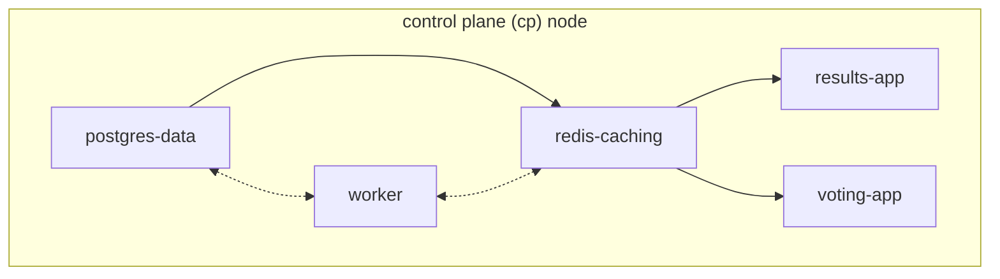

# The Microservices

A Brief review of the microservices _"architecture"_ here:



- **A Voting App**: A frontend app with an api + a frontend, where users can login and vote 1 of 2 options (_simple webapp here_)
- **A redis datastore**
- **A postgres DB**
- **A "worker" service** that syncs data from the redis service to the postgres service
- **A Voting-Results App**: Another frontend that show vote tallies, mocking an "analytics" frontend

Each service will get a pod.

- [The Microservices](#the-microservices)
  - [Definition File Directory Structure](#definition-file-directory-structure)
  - [The Definition Files](#the-definition-files)
    - [Pods](#pods)
    - [Services](#services)
  - [Building The Services with Kubectl](#building-the-services-with-kubectl)
    - [The Voting-App Services](#the-voting-app-services)
      - [See the Voting App with minikube](#see-the-voting-app-with-minikube)
    - [The Redis Services](#the-redis-services)
    - [The Postgres Services](#the-postgres-services)
    - [The Worker Service](#the-worker-service)
    - [The Results Services](#the-results-services)
  - [Some Consistent Details to Remember](#some-consistent-details-to-remember)

## Definition File Directory Structure

```bash
# all configs go in a "cfgs" dir
/cfgs
  # config "types" get broken into sub-directories
  /pods
    pg.yaml           # postgres
    redis.yaml        # redis
    results-app.yaml  # web-app
    voting-app.yaml   # web-app
    worker.yaml       # db-syncing
  /services
    redis.yaml        # internal service
    pg.yaml           # internal service
```

## The Definition Files

Note: the externalIps key/val pair are to publicize the nodes through docker - some detail I'm not 1000% sure about...

### Pods

Postgres:

```yaml
apiVersion: v1
kind: Pod
metadata:
  name: pg-pod
  labels:
    name: pg-pod
    app: demo-voting-app
spec:
  containers:
    - name: pg-box
      image: postgres:9.4
      ports:
        # default
        - containerPort: 5432
      # hard-coded for p.o.c here
      # these are hard-coded in other pod code
      env:
        - name: POSTGRES_USER
          value: "postgres"
        - name: POSTGRES_PASSWORD
          value: "postgres"
```

redis:

```yaml
apiVersion: v1
kind: Pod
metadata:
  name: redis-pod
  labels:
    name: redis-pod
    app: demo-voting-app
spec:
  containers:
    # hard-coded per service codebase
    - name: redis
      image: redis
      ports:
        # default
        - containerPort: 6379
```

results App:

```yaml
apiVersion: v1
kind: Pod
metadata:
  name: result-app-pod
  labels:
    name: result-app-pod
    app: demo-voting-app
spec:
  containers:
    - name: result-app-box
      image: kodekloud/examplevotingapp_result:v1
      ports:
        # app listens on port 80
        - containerPort: 80
```

voting app:

```yaml
apiVersion: v1
kind: Pod
metadata:
  name: voting-app-pod
  labels:
    name: voting-app-pod
    app: demo-voting-app
spec:
  containers:
    - name: voting-app-box
      image: kodekloud/examplevotingapp_vote:v1
      ports:
        # app listens on port 80
        - containerPort: 80
```

worker service:

```yaml
apiVersion: v1
kind: Pod
metadata:
  name: worker-pod
  labels:
    name: worker-pod
    app: demo-voting-app
spec:
  containers:
    - name: worker-box
      image: kodekloud/examplevotingapp_worker:v1
```

### Services

Postgres Service:

```yaml
# NOTE: no ports as this is not available to other apps
apiVersion: v1
kind: Service
metadata:
  # this is hard-coded in the worker code
  name: db
  labels:
    name: db-service
    app: demo-voting-app
spec:
  ports:
    - port: 5432
      targetPort: 5432
  selector:
    # match the pod labels from the pg yaml
    name: pg-pod
    app: demo-voting-app
```

Redis Service:

```yaml
# NOTE: no ports as this is not available to other apps
apiVersion: v1
kind: Service
metadata:
  name: redis
  labels:
    name: redis-service
    app: demo-voting-app
spec:
  ports:
    - port: 6379
      targetPort: 6379
  selector:
    # match the pod labels from the redis yaml
    name: redis-pod
    app: demo-voting-app
```

Results Service:

```yaml
# NOTE: no ports as this is not available to other apps
apiVersion: v1
kind: Service
metadata:
  name: result-service
  labels:
    name: result-service
    app: demo-voting-app
spec:
  type: NodePort
  ports:
    - port: 80
      targetPort: 80
      nodePort: 30004
  selector:
    # match the pod labels from the pg yaml
    name: result-app-pod
    app: demo-voting-app
  externalIPs:
    - 1.2.3.111
```

Voting Service:

```yaml
# NOTE: no ports as this is not available to other apps
apiVersion: v1
kind: Service
metadata:
  name: voting-service
  labels:
    name: voting-service
    app: demo-voting-app
spec:
  type: NodePort
  ports:
    - port: 80
      targetPort: 80
      nodePort: 30005
  selector:
    # match the pod labels from the pg yaml
    name: voting-app-pod
    app: demo-voting-app
  # makes it available through docker...
  externalIPs:
    - 1.2.3.110
```

## Building The Services with Kubectl

### The Voting-App Services

```bash
# the voting-app pod
Jakes-4:k8s Jake$ kubectl create -f cfgs/pods/voting-app.yaml
pod/voting-app-pod created

# the voting-app service
Jakes-4:k8s Jake$ kubectl create -f cfgs/services/voting-app.yaml
service/voting-service created

# see em
Jakes-4:k8s Jake$ kubectl get all
NAME                 READY   STATUS    RESTARTS   AGE
pod/voting-app-pod   1/1     Running   0          108s

NAME                     TYPE        CLUSTER-IP     EXTERNAL-IP   PORT(S)        AGE
service/kubernetes       ClusterIP   10.96.0.1      <none>        443/TCP        12d
service/voting-service   NodePort    10.101.11.48   <none>        80:30005/TCP   35s

#
# see em, differently
#
Jakes-4:k8s Jake$ kubectl get pods,svc
NAME                 READY   STATUS    RESTARTS   AGE
pod/voting-app-pod   1/1     Running   0          3m9s

NAME                     TYPE        CLUSTER-IP     EXTERNAL-IP   PORT(S)        AGE
service/kubernetes       ClusterIP   10.96.0.1      <none>        443/TCP        12d
service/voting-service   NodePort    10.101.11.48   <none>        80:30005/TCP   116s
```

#### See the Voting App with minikube

```bash
Jakes-4:k8s Jake$ minikube service voting-service --url
http://127.0.0.1:51286
```

go there!

### The Redis Services

```bash
Jakes-4:k8s Jake$ kubectl create -f cfgs/pods/redis.yaml
pod/redis-pod created
Jakes-4:k8s Jake$ kubectl create -f cfgs/services/redis.yaml
service/redis-service created

# see it all
Jakes-4:k8s Jake$ kubectl get pods,svc
NAME                 READY   STATUS    RESTARTS   AGE
pod/redis-pod        1/1     Running   0          26s
pod/voting-app-pod   1/1     Running   0          11m

NAME                     TYPE        CLUSTER-IP      EXTERNAL-IP   PORT(S)        AGE
service/kubernetes       ClusterIP   10.96.0.1       <none>        443/TCP        12d
service/redis-service    ClusterIP   10.108.99.93    <none>        6379/TCP       20s
service/voting-service   NodePort    10.110.227.44   1.2.3.110     80:30005/TCP   6m19s
```

### The Postgres Services

```bash
Jakes-4:k8s Jake$ kubectl create -f cfgs/pods/pg.yaml
pod/pg-pod created
Jakes-4:k8s Jake$ kubectl create -f cfgs/services/pg.yaml
service/db created

# see it all
Jakes-4:k8s Jake$ kubectl get pods,svc
NAME                 READY   STATUS    RESTARTS   AGE
pod/pg-pod           1/1     Running   0          25s
pod/redis-pod        1/1     Running   0          2m10s
pod/voting-app-pod   1/1     Running   0          13m

NAME                     TYPE        CLUSTER-IP      EXTERNAL-IP   PORT(S)        AGE
service/db               ClusterIP   10.108.7.31     <none>        5432/TCP       18s
service/kubernetes       ClusterIP   10.96.0.1       <none>        443/TCP        12d
service/redis-service    ClusterIP   10.108.99.93    <none>        6379/TCP       2m4s
service/voting-service   NodePort    10.110.227.44   1.2.3.110     80:30005/TCP   8m3s
```

### The Worker Service

```bash
Jakes-4:k8s Jake$ kubectl create -f cfgs/pods/worker.yaml
pod/worker-pod created
```

### The Results Services

```bash
Jakes-4:k8s Jake$ kubectl create -f cfgs/pods/result-app.yaml
pod/result-app-pod created
Jakes-4:k8s Jake$ kubectl create -f cfgs/services/result-app.yaml
service/result-service created
```

## Some Consistent Details to Remember

Pay.  
Attention.  
To details.  
To spelling.  
To port numbers.  
To Directions.  
Pod names, deployment names, service names, namespace names.  
These things, although they don't take up a lot of code (_perhaps compared to building a backend system or a complex single-page app_), these _details_ make-or-break the kubernetes world.
