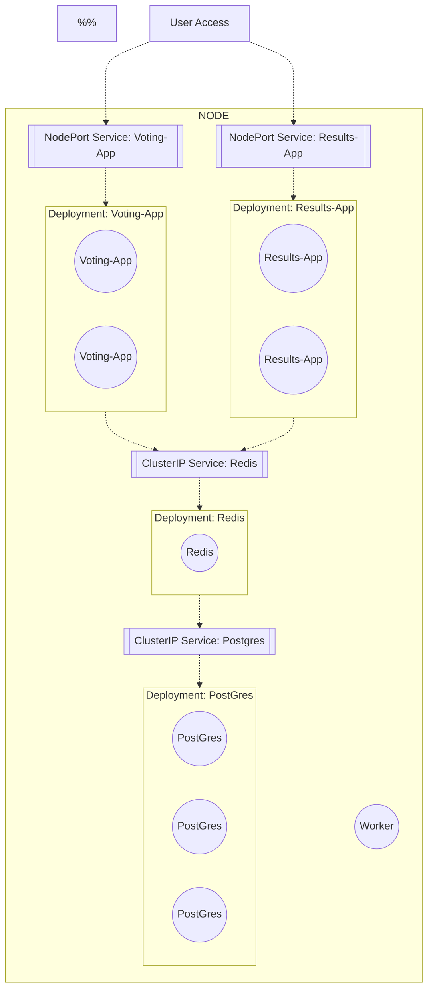

# From Sensitive Single-Pod Deployments to Replica Set Resilliancy
In a [previous post](/k8s/microservice-demo), a k8s cluster manages a handful of objects:
- 5 pods, each 1 "service" in a "microservice" style application
- 4 services, allowing explicit connectivity between the pods
  - 2 open-to-the-world services, webapps
  - 2 internal-only data stores, postgres and redis

This style of deployment is great for illustrating one "simple" way of deploying apps with pods, services, and kubernetes - for me specifically using minukube and k8s in docker, due to my current M1 mac restrictions and some online suggestions!  

- [From Sensitive Single-Pod Deployments to Replica Set Resilliancy](#from-sensitive-single-pod-deployments-to-replica-set-resilliancy)
  - [More Pods for Frontend Apps](#more-pods-for-frontend-apps)
  - [Comparing Pod-Based Deployments to Deployment-Managed Deployemnts](#comparing-pod-based-deployments-to-deployment-managed-deployemnts)
  - [Config Directory Structure](#config-directory-structure)
  - [Deployment Files](#deployment-files)
  - [Deploying the Deployments](#deploying-the-deployments)
    - [The Voting App](#the-voting-app)
    - [Redis](#redis)
    - [Postgres](#postgres)
    - [worker](#worker)
    - [results app](#results-app)
  - [Scaling Up Live!](#scaling-up-live)
    - [Edit The Results App Config File](#edit-the-results-app-config-file)
  - [A Diagram](#a-diagram)
## More Pods for Frontend Apps
Here, The frontend-facing apps (_voting-app and result-app_) will get replica-sets through deployments. Deployments will "manage" the replica sets of the pods.  

## Comparing Pod-Based Deployments to Deployment-Managed Deployemnts  
In some ways, using kubernetes deployemnt objects is "easier" that pod definition files. Deployments at least have more features:  
- the deployment will "manage" pods with a bit more automation than manual pod management
- the deployment config file can include the number of replica pods to manage
  - when 1+ pod(s) "dies" in a deployment, it gets automagically re-created by k8s

The deployment of the pods and services is also a bit different between this deployment-managed approach and a single-od-deployment approach:
- in a single-pod approach, each pod gets a definition file and a deploy command
- in a deployment-managed approach each **deployment** gets a definition file and a deploy command
  - the difference here is implicit in that each deployment can have many pods per single definition file!!

## Config Directory Structure
```bash
/cfgs
  /deployments
    redis.yaml
    pg.yaml
    worker.yaml
    voting-app.yaml
    results-app.yaml
```
## Deployment Files

Redis
```yaml
apiVersion: apps/v1
kind: Deployment
metadata:
  name: redis-deploy
  labels:
    name: redis-deploy
    app: demo-voting-app
spec:
  # save resources on my laptop!
  replicas: 1
  selector:
    matchLabels:
      name: redis-pod
      app: demo-voting-app
  template:
    metadata:
      name: redis-pod
      labels:
        name: redis-pod
        app: demo-voting-app
    spec:
      containers:
        - name: redis
          image: redis
          ports:
            - containerPort: 6379
```

postgres
```yaml
apiVersion: apps/v1
kind: Deployment
metadata:
  name: pg-deploy
  labels:
    name: pg-deploy
    app: demo-voting-app
spec:
  replicas: 1
  selector:
    matchLabels:
      name: pg-pod
      app: demo-voting-app
  template:
    metadata:
      name: pg-pod
      labels:
        name: pg-pod
        app: demo-voting-app
    spec:
      containers:
        - name: pg-box
          image: postgres
          ports:
            - containerPort: 5432
          env:
            - name: POSTGRES_USER
              value: "postgres"
            - name: POSTGRES_PASSWORD
              value: "postgres"
              # hmm... this....
            - name: POSTGRES_HOST_AUTH_METHOD
              value: trust

```

worker
```yaml
apiVersion: apps/v1
kind: Deployment
metadata:
  name: worker-deploy
  labels:
    name: worker-deploy
    app: demo-voting-app
spec:
  replicas: 1
  selector:
    matchLabels:
      name: worker-pod
      app: demo-voting-app
  template:
    metadata:
      name: worker-pod
      labels:
        name: worker-pod
        app: demo-voting-app
    spec:
      containers:
        - name: worker-box
          image: kodekloud/examplevotingapp_worker:v1
```

results-app
```yaml
apiVersion: v1
kind: Deployment
metadata:
  name: result-app-deploy
  labels:
    name: result-app-deploy
    app: demo-voting-app
spec:
  replicas: 1
  selector:
    matchLabels:
      name: result-app-pod
      app: demo-voting-app
  template:
    metadata:
      name: result-app-pod
      labels:
        name: result-app-pod
        app: demo-voting-app
    spec:
      containers:
        - name: result-app-box
          image: kodekloud/examplevotingapp_result:v1
          ports:
            - containerPort: 80
```

voting-app
```yaml
apiVersion: apps/v1
kind: Deployment
metadata:
  name: voting-app-deploy
  labels:
    name: voting-app-deploy
    app: demo-voting-app
spec:
  # to save resources on my laptop!
  replicas: 1
  selector:
    matchLabels:
      # match the voting-app pod def file
      name: voting-app-pod
      app: demo-voting-app
  template:
    # metadata taken directly from pod def file
    metadata:
      name: voting-app-pod
      labels:
        name: voting-app-pod
        app: demo-voting-app
    spec:
      containers:
        - name: voting-app-box
          image: kodekloud/examplevotingapp_vote:v1
          ports:
            # app listens on port 80
            - containerPort: 80
```

## Deploying the Deployments
Validate that no pods or services are running. If you happen to be following along from the previous article, ["A Microservice K8s Demo"](k8s/microservice-demo), The previous article leaves pods & services running. delete them before running these.  

### The Voting App
```bash
Jakes-4:k8s Jake$ kubectl create -f cfgs/deployments/voting-app.yaml 
deployment.apps/voting-app-deploy created
Jakes-4:k8s Jake$ kubectl create -f cfgs/services/voting-app.yaml 
service/voting-service created

# check the deployment!
NAME                READY   UP-TO-DATE   AVAILABLE   AGE
voting-app-deploy   1/1     1            1           30s
```

### Redis
```bash
Jakes-4:k8s Jake$ kubectl create -f cfgs/deployments/redis.yaml 
deployment.apps/redis-deploy created
Jakes-4:k8s Jake$ kubectl create -f cfgs/services/redis.yaml 
service/redis created

# check it
Jakes-4:k8s Jake$ kubectl get deployments
NAME                READY   UP-TO-DATE   AVAILABLE   AGE
redis-deploy        1/1     1            1           12s
voting-app-deploy   1/1     1            1           99s
```

### Postgres
```bash
Jakes-4:k8s Jake$ kubectl create -f cfgs/deployments/pg.yaml 
deployment.apps/pg-deploy created
Jakes-4:k8s Jake$ kubectl create -f cfgs/services/pg.yaml 
service/db created
Jakes-4:k8s Jake$ kubectl get deployments
NAME                READY   UP-TO-DATE   AVAILABLE   AGE
pg-deploy           1/1     1            1           8s
redis-deploy        1/1     1            1           81s
voting-app-deploy   1/1     1            1           2m48s
```

### worker
```bash
Jakes-4:k8s Jake$ kubectl create -f cfgs/deployments/worker.yaml 
deployment.apps/worker-deploy created

# check em!
# NOTE: the worker has no service running - its a pod with no service :) 
Jakes-4:k8s Jake$ kubectl get pods,svc
NAME                                     READY   STATUS    RESTARTS      AGE
pod/pg-deploy-66b86c6c96-d6hpx           1/1     Running   0             115s
pod/redis-deploy-7f878dfd46-dfct6        1/1     Running   0             3m8s
pod/voting-app-deploy-664d76547c-2mfgn   1/1     Running   0             4m35s
pod/worker-deploy-745ff6d7f-7t7sj        1/1     Running   2 (18s ago)   24s

NAME                     TYPE        CLUSTER-IP      EXTERNAL-IP   PORT(S)        AGE
service/db               ClusterIP   10.99.48.13     <none>        5432/TCP       110s
service/kubernetes       ClusterIP   10.96.0.1       <none>        443/TCP        13d
service/redis            ClusterIP   10.97.51.245    <none>        6379/TCP       3m2s
service/voting-service   NodePort    10.97.220.203   1.2.3.110     80:30005/TCP   4m24s
```


### results app
do the same with the results config :) 


## Scaling Up Live!
One major benefit of deployments is that the deployment "object" will "manage" pods, like when pods crash or when pods get scaled...live!! zero down time!!!

### Edit The Results App Config File
The deployment "watches" deployment config files & wiill adjust the deployed pods & services accordingly.  
Here, the `replicas` will be edited in the result-app config file.  

```bash
# Edit the result app deployment to have 1 replica instead of 3
kubectl edit deployment result-app-deploy --record

# the config will show in the terminal
# find the replicas line and edit to be 1 instead of the 
# :wq! to exit

# check the deployment, see 1/1 instead of 3/3 for the result-app-deploy
Jakes-4:k8s Jake$ kubectl get deployments
NAME                READY   UP-TO-DATE   AVAILABLE   AGE
pg-deploy           1/1     1            1           25h
redis-deploy        1/1     1            1           25h
result-app-deploy   1/1     1            1           16m
voting-app-deploy   1/1     1            1           25h
worker-deploy       1/1     1            1           25h
```


## A Diagram
