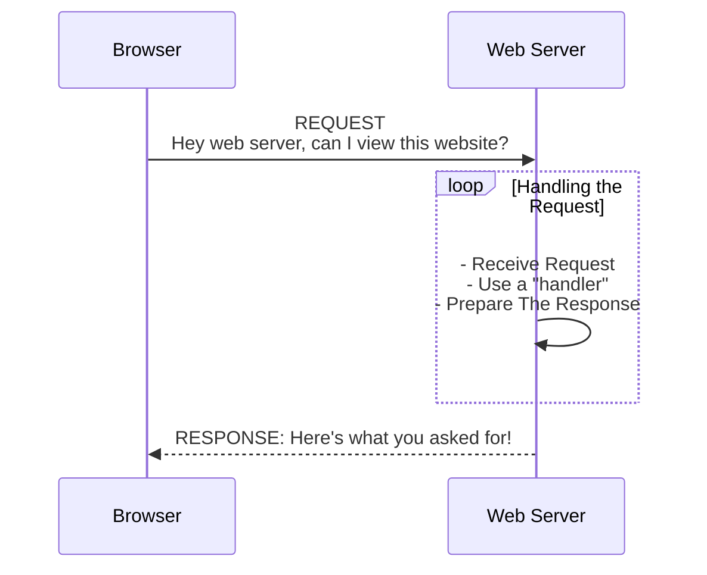

# Serving Content Over The Web

## What Is A Server
A Server is a computer. When it comes to the internet, "web servers" are computers that...
- have http* server tooling (like node's built-in [http module](https://nodejs.org/dist/latest-v18.x/docs/api/http.html))
- the http* server listening for requests over the [http protocol](https://developer.mozilla.org/en-US/docs/Web/HTTP/Overview)
- the http* server can respond to http requests and send to the requester some data

*Note: http could also be [http/2](https://nodejs.org/dist/latest-v18.x/docs/api/http2.html) or [https](https://nodejs.org/dist/latest-v18.x/docs/api/https.html).  
