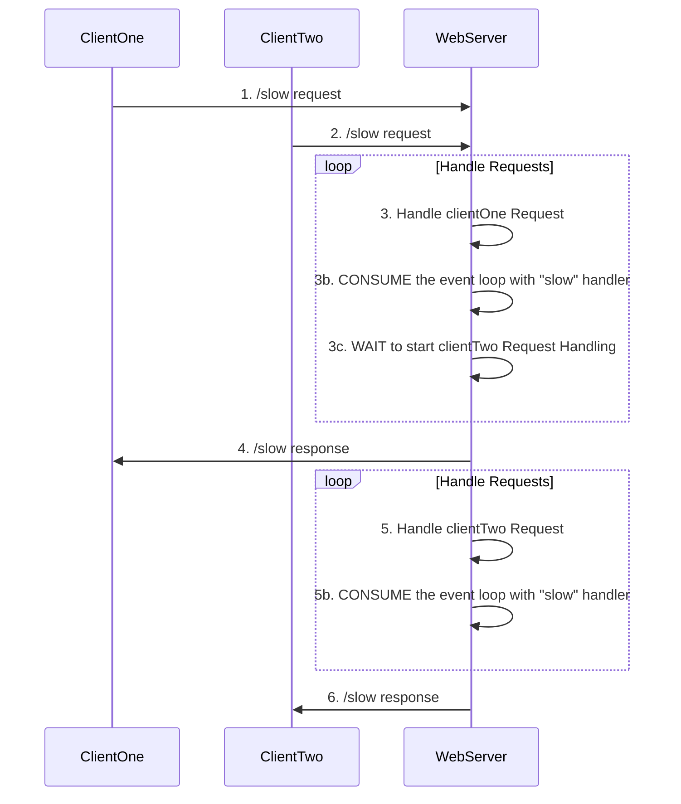

# The Event-Loop And Web Servers
Using [the event loop](/node/event-loop) well is critical to building a highly available and performant web server.  
The event loop [is pretty easy to block](/node/event-loop/blocking), so understanding how to keep the event loop unblocked is important.  
To illustrate how the event loop interacts with web servers, below are a few examples:

## A Web Server, Fast And Slow
Here is a simple server.  
It has 2 endpoints, one fast and one slow (named accordingly).  

```js
const e = require('express');
const app = e();
const port = process.env.PORT || 8080;
const HOW_MANY_ITERATIONS = 3e9

function slowHandler(req, res) {
  console.time('slowHandler')
  // mock a slow, BLOCKING process;
  for(var x = 0; x < HOW_MANY_ITERATIONS; x++){}
  res.send('server response here!')
  console.timeEnd('slowHandler');
}

function fastHandler(req, res) {
  console.time('fastHandler')
  res.send('fast!')
  console.timeEnd('fastHandler');
}
app.get('/fast', fastHandler)
app.get('/slow', slowHandler)

app.listen(port, () => {
  console.log(`plain-server is running on port ${port}`);
})
```  
Try making a few requests through a browser:
- `localhost:8080/fast` will send + receive content FAST. find the log for fastHandler. I ran it 5x in a row and got....
```bash
fastHandler: 9.331ms
fastHandler: 0.934ms
fastHandler: 0.449ms
fastHandler: 0.387ms
fastHandler: 0.681ms
```
- `localhost:8080/slow` will send + receive content SLOW. find the log for slowHandler. I ran it 3x in a row and got....
```bash
slowHandler: 4.661s
slowHandler: 1.537s
slowHandler: 4.628s
```


### An Evet-Loop Blocking Web-Server Process
The `/slow` endpoint above blocks the event loop.  
The event loop in a rest api is one of node's most powerful tools, but when the event loop is blocked the api and node might seem like bad choices gone wrong.  

