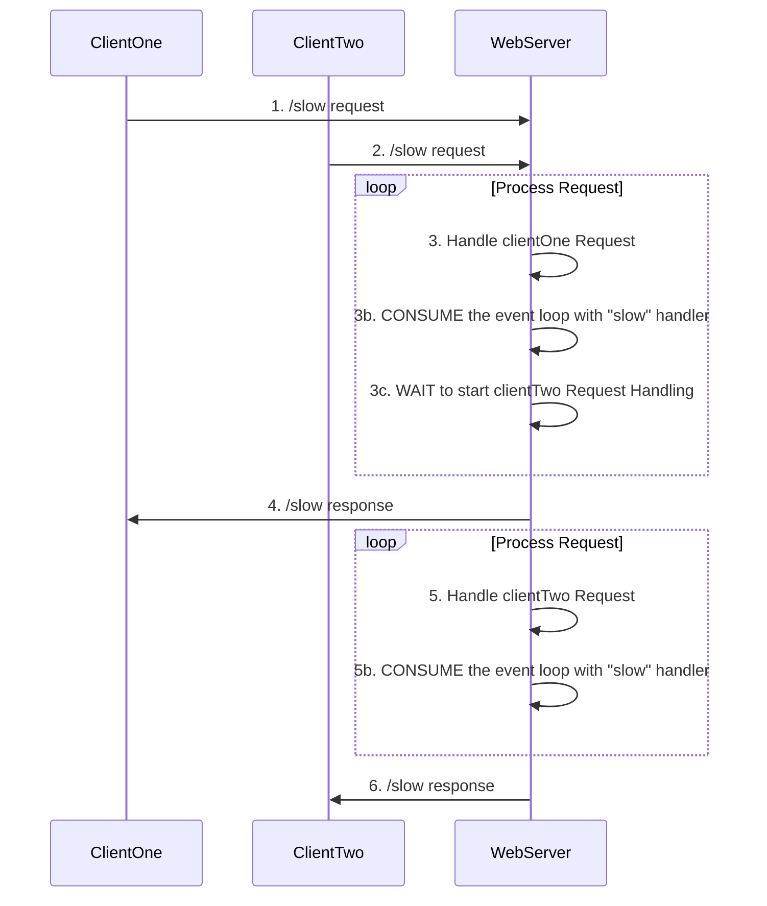
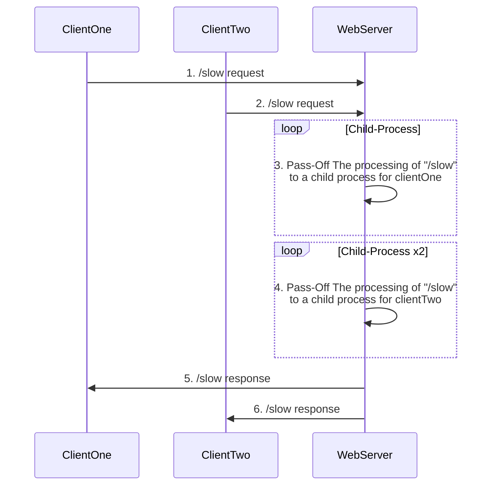

# The Event-Loop And Web Servers
Using [the event loop](/node/event-loop) well is critical to building a highly available and performant web server.  
The event loop [is pretty easy to block](/node/event-loop/blocking), so understanding how to keep the event loop unblocked is important.  
To illustrate how the event loop interacts with web servers, below are a few examples.

- [The Event-Loop And Web Servers](#the-event-loop-and-web-servers)
  - [A Web Server, Fast And Slow](#a-web-server-fast-and-slow)
    - [An Evet-Loop Blocking Web-Server Process](#an-evet-loop-blocking-web-server-process)
      - [Blocking Adds Time To Responses](#blocking-adds-time-to-responses)
    - [A Non-Blocking Approach](#a-non-blocking-approach)
      - [Non-Blocking Reduces Time To Responses](#non-blocking-reduces-time-to-responses)


## A Web Server, Fast And Slow
Here is a simple server.  
It has 2 endpoints, one fast and one slow (named accordingly).  

```js
const e = require('express');
const app = e();
const port = process.env.PORT || 8080;
const HOW_MANY_ITERATIONS = 3e9

function slowHandler(req, res) {
  console.time('slowHandler')
  // mock a slow, BLOCKING process;
  for(var x = 0; x < HOW_MANY_ITERATIONS; x++){}
  res.send('server response here!')
  console.timeEnd('slowHandler');
}

function fastHandler(req, res) {
  console.time('fastHandler')
  res.send('fast!')
  console.timeEnd('fastHandler');
}
app.get('/fast', fastHandler)
app.get('/slow', slowHandler)

app.listen(port, () => {
  console.log(`plain-server is running on port ${port}`);
})
```  
Try making a few requests through a browser:
- `localhost:8080/fast` will send + receive content FAST. find the log for fastHandler. I ran it 5x in a row and got....
```bash
fastHandler: 9.331ms
fastHandler: 0.934ms
fastHandler: 0.449ms
fastHandler: 0.387ms
fastHandler: 0.681ms
```
- `localhost:8080/slow` will send + receive content SLOW. find the log for slowHandler. I ran it 3x in a row and got....
```bash
slowHandler: 4.661s
slowHandler: 1.537s
slowHandler: 4.628s
```

### An Evet-Loop Blocking Web-Server Process
The `/slow` endpoint above blocks the event loop.  
The event loop in a rest api is one of node's most powerful tools, but when the event loop is blocked the api and node might seem like bad choices gone wrong.  



In the above diagram, node leverages the event loop and the call stack to manage the two requests from `clientOne` and `clientTwo`.  
- (1) the event loop recieves the request from `clientOne`
- (2) the event loop recieves the request from `clientTwo`, and "stores" the request in the call stack event queue
- (3) the event loop, more or less, starts the loop in `/slow` handler, blocking the event loop from doing anything else. This is where the request from `clientTwo` has to _wait_ for the handling of the request from `clientOne` to be completed before starting the handling of the request for `clientTwo`
- (4) the event loop eventually finished handling logic of the request from `clientOne` and returns a result
- (5) Node "pulls from" the call stack & starts the processing of the request from `clientTwo`, blocking the event loop from doing anything else. This is where the serverhas to _wait_ for the handling of the request from `clientTwo` to be completed before starting the handling of any other requests (_here there are no other requests, but maybe the point is clear_)

#### Blocking Adds Time To Responses
- "/slow" handler takes... ~4s
- request from clientOne comes in at 1:00
- webServer starts processing clientOne request logic ~1:00
- request from clientTwo comes in at 1:01
- clientOne gets a response ~ 1:04 - ~4s after clientOne request
- webServer starts processing clientTwo request logic ~1:04
- clientTwo gets a response ~ 1:08 - ~4s after starting processing for clientTwo

### A Non-Blocking Approach 


#### Non-Blocking Reduces Time To Responses
- "/slow" handler takes... ~4s
- request from clientOne comes in at 1:00
- webServer starts processing clientOne request logic ~1:00
  - NOTE: web-server "hands-off" the processing to a child_process, creating a webserver
- request from clientTwo comes in at 1:01
- webServer starts processing clientTwo request logic ~1:01
- clientOne gets a response ~ 1:04 - ~4s after clientOne request
- clientTwo gets a response ~ 1:05 - ~4s after starting processing for clientTwo