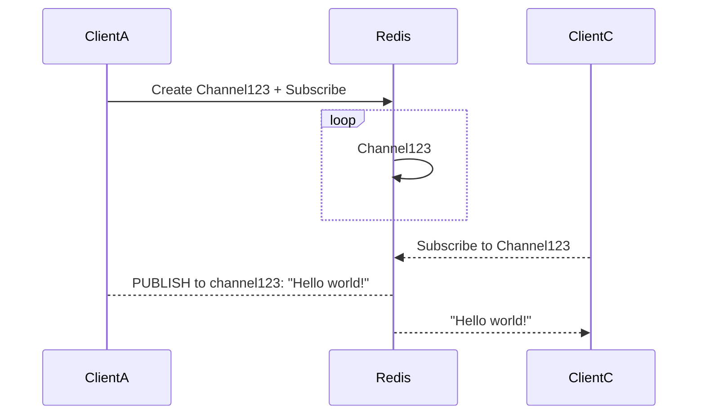

# Publish and Subscribe
Post messages to redis. To a channel.    
Consume messages from redis. From a channel.    
- `PUBLISH <channel> <message>`
- `SUBSCRIBE <channel> <...maybe other channels>`
- `UNSIBSCRIBE <channel> <...maybe other channels>`
- `PSUBSCRIBE <pattern>` (_with regex_)
- `PUNSUBSCRIBE <pattern>` (_with regex_)
- `PUBSUB <command>` - introspection into the mechanism itself

## The Paradigm In A diagram
