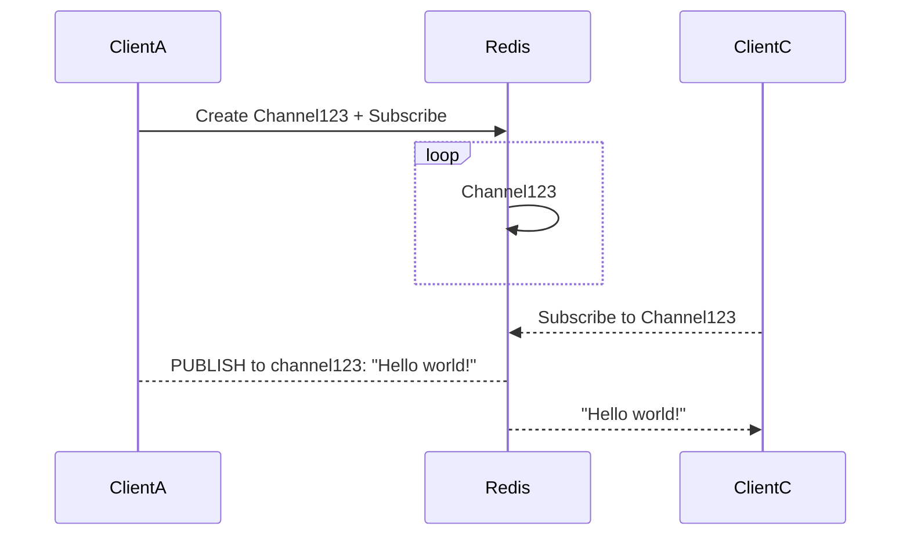

# Publish and Subscribe
Post messages to redis. To a channel.    
Consume messages from redis. From a channel.    
- `PUBLISH <channel> <message>`
  - the message can be text, numbers, binary, a serialized json blob... 
- `SUBSCRIBE <channel> <...maybe other channels>`
- `UNSIBSCRIBE <channel> <...maybe other channels>`
- `PSUBSCRIBE <pattern>` (_with regex_)
- `PUNSUBSCRIBE <pattern>` (_with regex_)
- `PUBSUB <command>` - introspection into the mechanism itself

## PubSub In A diagram


The more clients subscribed to a channel, the more data is published over the wire. The same publish event will push to all subscribers.  

## PubSub With 2 Terminals
```bash
# terminal one
redis-cli> subscribe channelOne
```

```bash
# terminal two
redis-cli> publish channelOne "hello from terminal two"
```
- get terminal one subscribed to a channel, here `channelOne`
  - redis will show something in the terminal like `Reading messages... (press Ctrl-C to quit or any key to type command)`
- get terminal two to publish a message to the channel: `hello from terminal two`
  - `(integer) 1` will appear, indicating 1 client heard the message
- SEE the message appear in terminal one
  - `1) "message" 2) "ch-1" 3) "hello from term 2"`

clients can subscribe to two channels
```bash
# in terminal one
redis-cli> subscribe channelOne channelTwo


# back in terminal two
redis-cli> publish channelTwo "channel two message from term two"
redis-cli> publish channelOne "channel one message from term two"
```
Those two messages from terminal one will appear in terminal two

## PubSub Commands
- `pubsub channels`
  - show channels 
- `pubsub numsu <channel>`
- `pubsub numpat <>`
  - show the number of patterns?
- `pubsub numsub <channel>`
  - show the number of subscribers to a channel

## Pattern-Matching Commands
`psubscribe` can be used to subscribe to a pattern-matched set of channels.  
Here, 2 clients

```bash
# clientOne
redis-cli> psubscribe channel?
1) "psubscribe"
2) "channel?"
3) (integer) 1
```

```bash
# clientTwo
redis-cli> publish channelA "Horse"
(integer) 1
redis-cli> 
redis-cli> publish channelB "Dog"
(integer) 1
```

```bash
# back in clientOne
redis-cli> psubscribe channel?
1) "psubscribe"
2) "channel?"
3) (integer) 1

# ....these wil be new!
1) "pmessage"
2) "channel?"
3) "channelA"
4) "Horse"
1) "pmessage"
2) "channel?"
3) "channelB"
4) "Dog"
```

One use-case for this pattern-matched subscription could be channels that have delimiters: `psubscribe people:*` can subscribe to all channels that start with `people:`.  


## Some Use-Cases
- an order system can publish to a `new_orders` channel, and order-handlers can subscribe to the `new_orders` channel
- feeds, streams, real-time message updates in a video chat thread