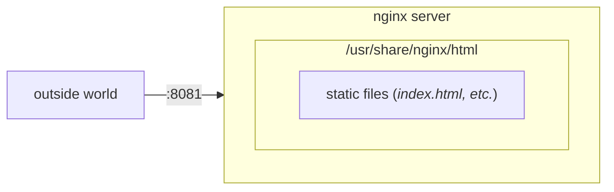

# nginx

- [nginx](#nginx)
  - [A Diagram](#a-diagram)
  - [A WebServer For Web Developers](#a-webserver-for-web-developers)
  - [Spin Up The Out-Of-The-Box Docker Image](#spin-up-the-out-of-the-box-docker-image)
  - [Leverage the default html dir to serve custom assets](#leverage-the-default-html-dir-to-serve-custom-assets)
    - [make an html dir and file to serve](#make-an-html-dir-and-file-to-serve)
    - [Run the container and mount the html dir](#run-the-container-and-mount-the-html-dir)

## A Diagram



## A WebServer For Web Developers

Coming from a "full-stack"-first developer set of experiences, [nginx](https://www.nginx.com/resources/glossary/nginx/) nginx might feel most similar to a web-server - something like an [express](https://expressjs.com/) server with [node](https://nodejs.org/en/). nginx, though, is used for different use-cases - a reverse proxy, caching assets, load balancing... things that can compliment what node apps might be more traditionally built to do.

## Spin Up The Out-Of-The-Box Docker Image

```bash
docker run --name ngx -p 8081:80 --hostname ng1 -d nginx
```

A brief rundown -

- use docker
- name the container `ngx`
- make the running container available on port `8081` on the host
- give it a hostname of `ng1`
- run it in the background

with that running, a browser at `localhost:8081` should show something like

```text
Welcome to nginx!

If you see this page, the nginx web server is successfully installed...
```

## Leverage the default html dir to serve custom assets

NGINX serves that html file above, that prints the above content, from a directory inside the container at `/usr/share/nginx/html`

### make an html dir and file to serve

```bash
# create a directory to hold the file
mkdir html

cd html
touch index.html

vi index.html
```

fill the file with something simple for a p.o.c here:

```html
<html>
  <head> </head>
  <body>
    <h2>This is my own html page!</h2>
  </body>
</html>
```

### Run the container and mount the html dir

```bash
docker run --name nx --hostname ng1 -p 8081:80 -v $PWD/html:/usr/share/nginx/html -d nginx
```

Using a browser to view `localhost:8081` will show the `This is my own html page!`
