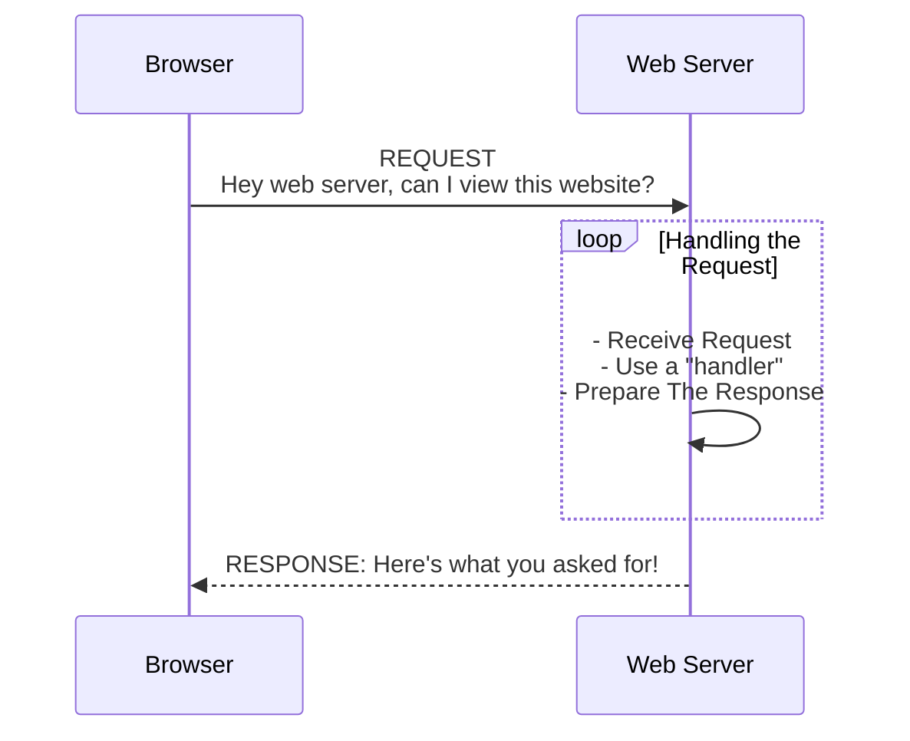

# Serving Content Over The Web

## What Is A Server
A Server is a computer. When it comes to the internet, there are "web servers". "web servers" are computers (servers) that...
- have http* server tooling (like node's built-in [http module](https://nodejs.org/dist/latest-v18.x/docs/api/http.html)) which...
  - **listening** for requests over the [http protocol](https://developer.mozilla.org/en-US/docs/Web/HTTP/Overview)
  - **responds to requests** (_typically from a browser or http client_) and sends to the requester some data

When going to a browser (google chrome, safari, firefox, opera, edge, brave, etc) and typing in a url `www.google.com`, the browser is making a request to the internet which eventually makes it to a server where the google website is served by a server.  

***Notes**
- http could also leverage [http/2](https://nodejs.org/dist/latest-v18.x/docs/api/http2.html) and/or [https](https://nodejs.org/dist/latest-v18.x/docs/api/https.html)
- for code examples of the http server, see these [trivial examples](/node/http-server/trivial-servers/) to get started  
