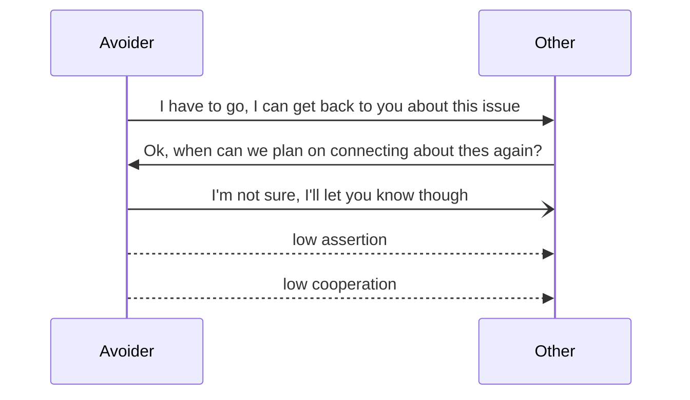
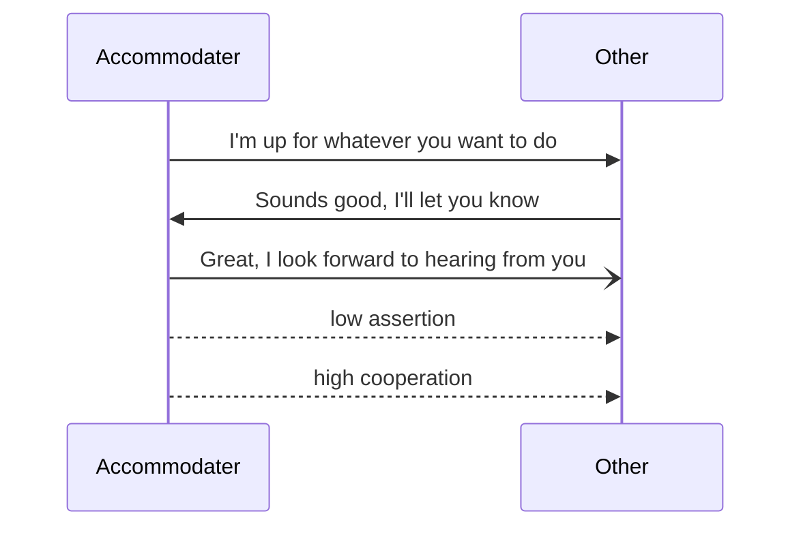
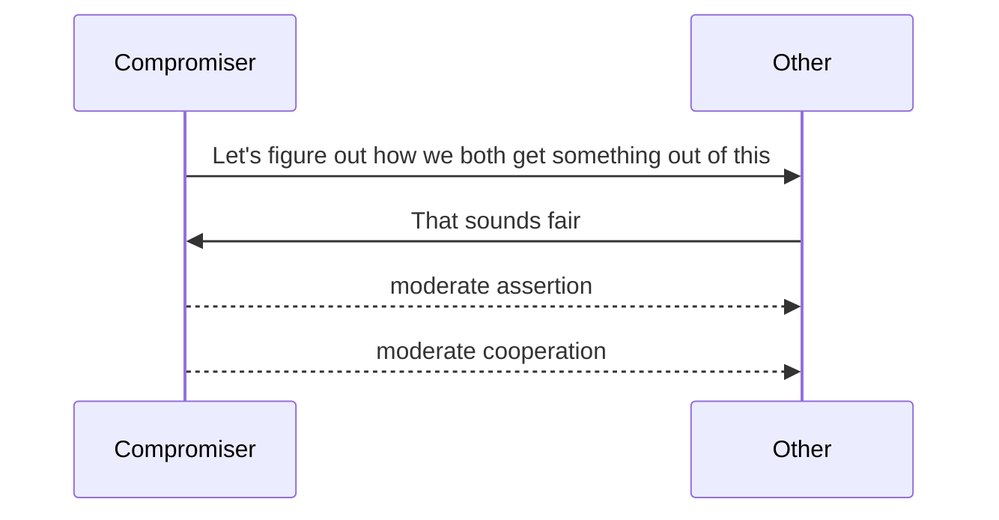
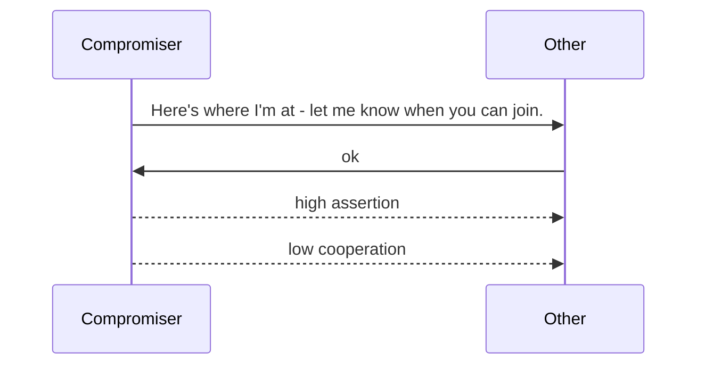

# Styles Of Handling Conflict

- [Styles Of Handling Conflict](#styles-of-handling-conflict)
  - [Avoiding: Lower Assertion, Lower Cooperation](#avoiding-lower-assertion-lower-cooperation)
  - [Accommodating: Lower Assertion, Higher Cooperation](#accommodating-lower-assertion-higher-cooperation)
  - [Compromising: Moderate Assertion, Moderate Cooperation](#compromising-moderate-assertion-moderate-cooperation)
  - [Competing: High Assertion, Low Cooperation](#competing-high-assertion-low-cooperation)
  - [Handling conflict with the "competing" style can look like a few things:](#handling-conflict-with-the-competing-style-can-look-like-a-few-things)
  - [References](#references)

## Avoiding: Lower Assertion, Lower Cooperation

Handling conflict with the "accommodating" style can look like a few things:
- deferring decisions to the other's decisions
- **POSITIVE** when stakes are low, and as a way of reducing conflict tensions
- **PROBLEMATIC** when this is a "fallback" style, and you might _really have a preference_. Your preference will likelybe missed, and you may develop a bit of a ["martyr complex"](https://www.webmd.com/mental-health/what-is-a-martyr-complex), putting indirect stress on a relationship

## Accommodating: Lower Assertion, Higher Cooperation

Handling conflict with the "accommodating" style can look like a few things:
- deferring decisions to the other's decisions
- **POSITIVE** when stakes are low, and as a way of reducing conflict tensions
- **PROBLEMATIC** when this is a "fallback" style, and you might _really have a preference_. Your preference will likelybe missed, and you may develop a bit of a ["martyr complex"](https://www.webmd.com/mental-health/what-is-a-martyr-complex), putting indirect stress on a relationship

## Compromising: Moderate Assertion, Moderate Cooperation

Handling conflict with the "compromising" style can look like a few things:
- figuring out how both parties involved can "come to terms" with both parties "loosing out" on something. An idealized outcome for both parties is not met here
- **POSITIVE** when a fair, equal, and non-ideal outcome might be the best outcome
- **PROBLEMATIC** when there might be "deeper" desires at hand

## Competing: High Assertion, Low Cooperation

Handling conflict with the "competing" style can look like a few things:
- 
- **POSITIVE** 
- **PROBLEMATIC** $$
- 
## References 
[The Thomas-Kilmann Conflict Mode](https://kilmanndiagnostics.com/overview-thomas-kilmann-conflict-mode-instrument-tki/) is the major influence of the conflict styles. I personally learned a bit about the 5 conflict styles through an [online certification from Cornell](https://ecornell.cornell.edu/).  