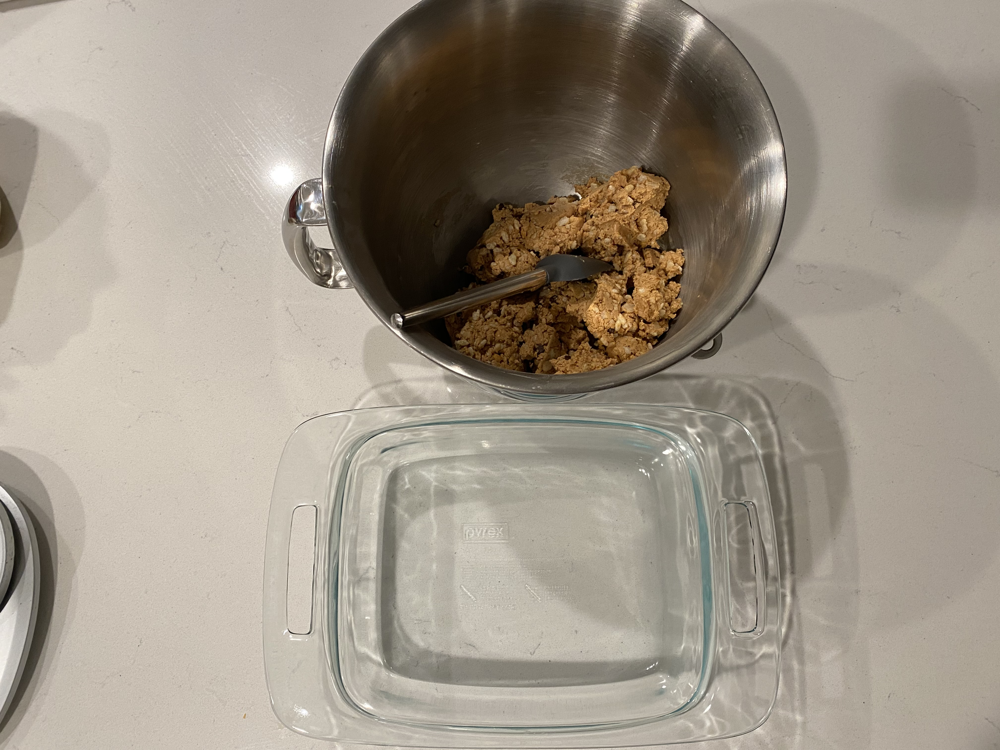
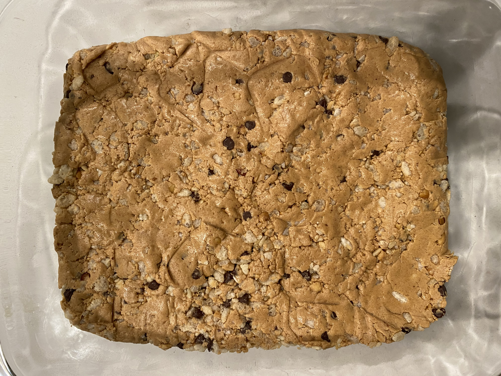
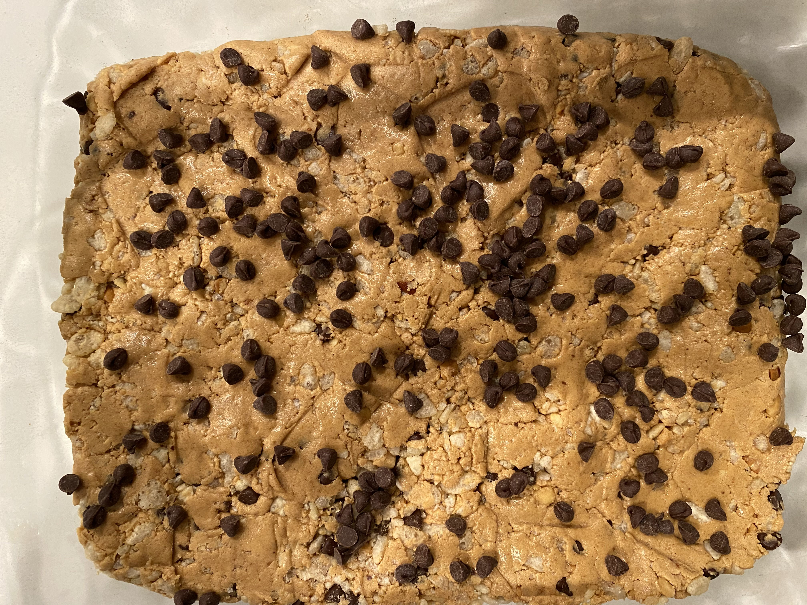

### Ingredients

- Egg White Protein Powder (80g)
- All Natural Peanut Butter (256g)
- Sweetener (_1/4C, maple syrup + honey mix_)
- puffed rice cereal (_1C_)
- Mini Chocolate Chips (_1/4C_)
- Maldon Sea Salt (_a few pinches_)

### Directions

<!-- #### First Mix -->

- add Peanut Butter to a mixing bowl - I use a stand mixer
- 
- add Sweetener (_maple syrup + honey mixture_) to the mixer
- 
- add protein powder to the mixing bowl
- 
- mix on low speed (_do not overmix_)
- 
- stop the mixer when the mix looks...well...mixed

#### Add in the Add-Ins

- dump most of the mini chocolate chips into the mix, as well as the mini puffed rice cereal
- 
- mix on low speed (_do not overmix_)
- 
- stop the mixer when the mix-ins look incorporated

#### Prep For Chilling

- press the mix into a 9x9 (_or similar size_) dish
- 
- sprink the rest of the mini chocolate chips across the top of the mix, and press the chips into the top
- 
- chill the bars (_The bars can probably be eaten now!_)
