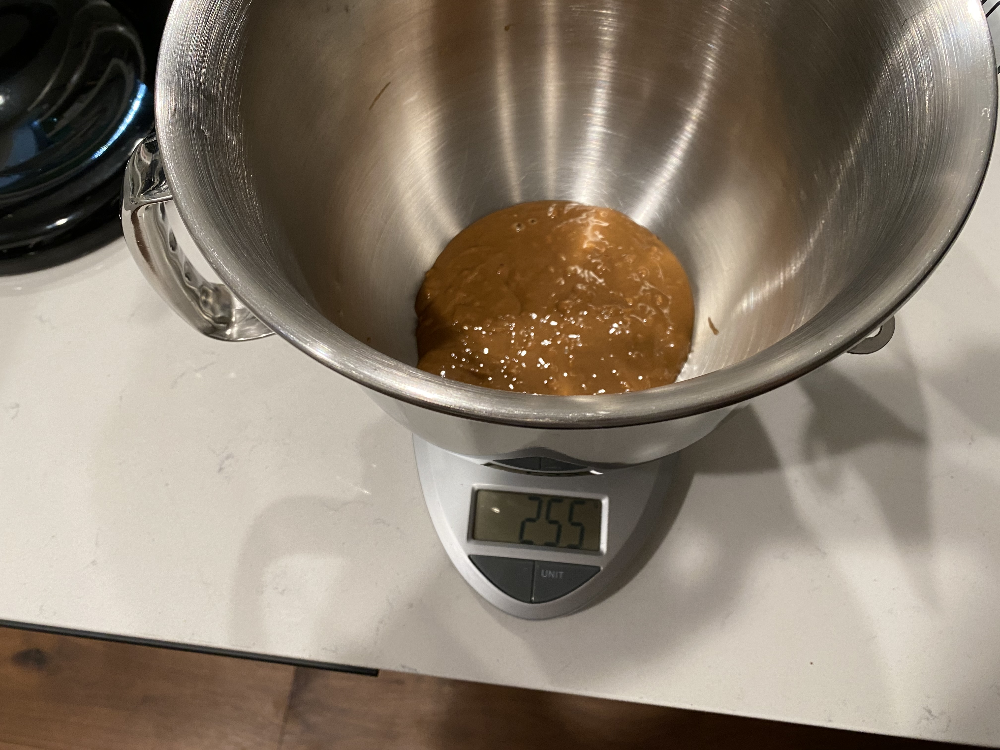
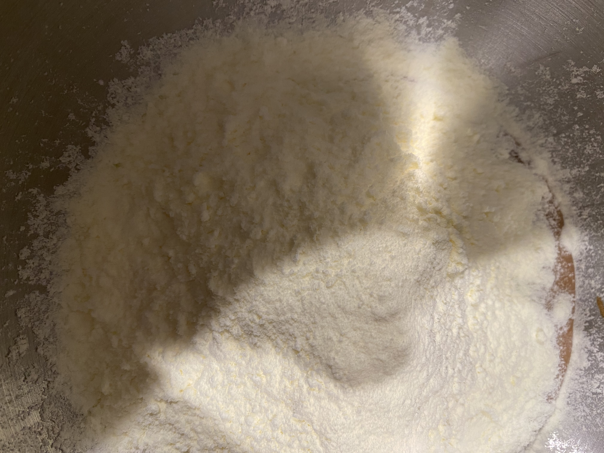
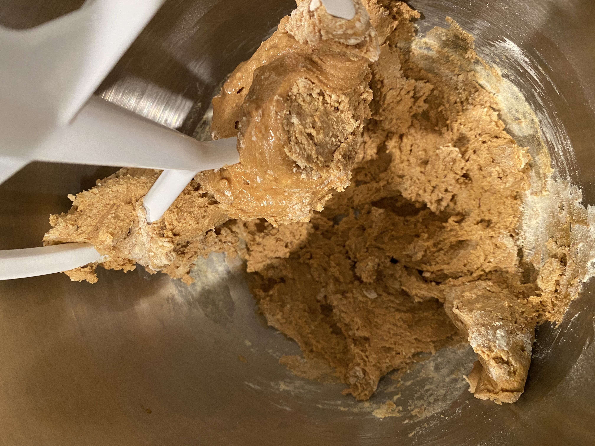
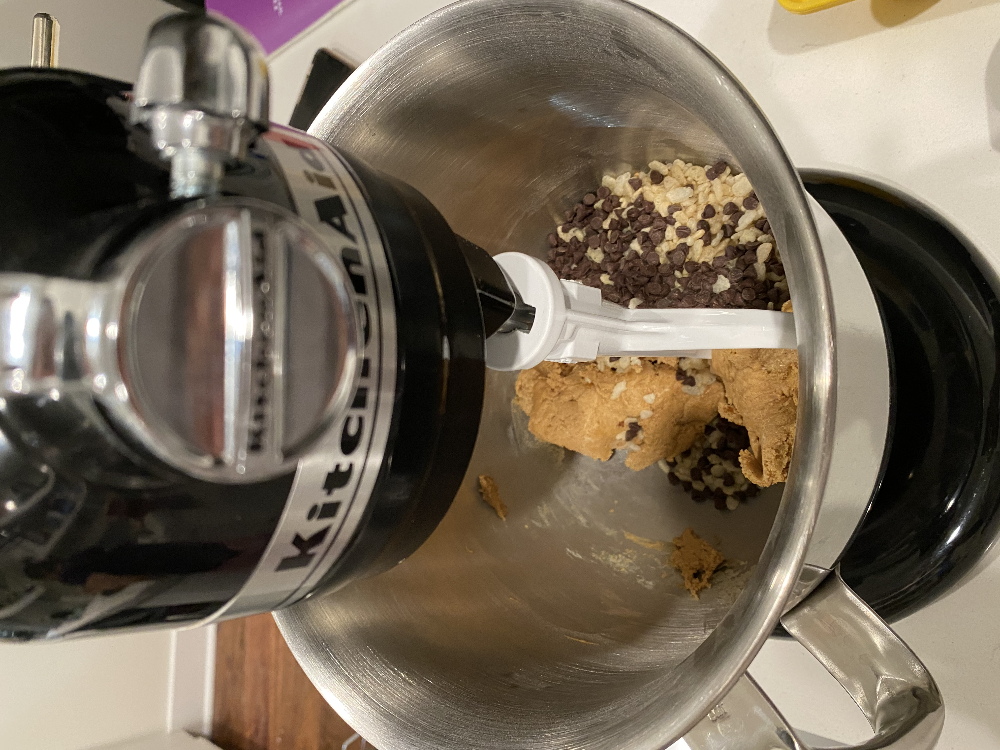

import Ingredient from './../../src/components/ingredient';

## Perfect Bars

### Ingredients

- Egg White Protein Powder (80g)
- All Natural Peanut Butter (256g)
- Sweetener (_1/4C, maple syrup + honey mix_)
- puffed rice cereal (_1C_)
- Mini Chocolate Chips (_1/4C_)
- Maldon Sea Salt (_a few pinches_)

### Directions

#### First Mix

- add 1C Peanut Butter to a mixing bowl - I use a stand mixer
- 
- add protein powder to the mixing bowl
- 
- mix on low speed - **do not overmix**
- 
- stop the mixer when the mix looks...well...mixed

#### Add in the Add-Ins

- dump most of the mini chocolate chips into the mix, as well as the mini puffed rice cereal
- 
- mix on low speed - **do not overmix**
- stop the mixer when the mix-ins look incorporated
