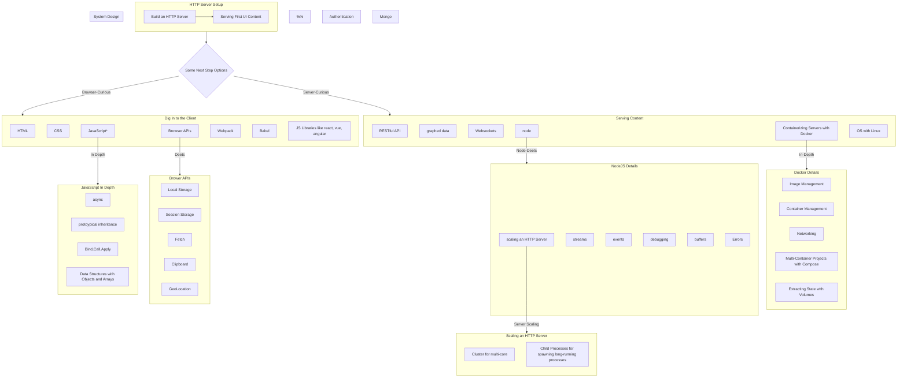

# Some Tech Involved in Building A Web App

The UI of a website and a web "app" are visually rewarding to work on - changing item colors, shapes, functionalities for the end-user...  
There are a lot of nuances in a lot of technologies involved in building web-based tools, though.  
Here are a bunch of technologies that may or may not be involved in a web-app.

## A Visual

Starting From an HTTP Server

## A Frontend-First Path

Learn...

- HTML: Documents, document elements, element attributes...
- CSS: The requirements with the cascade, selectors, the box model, positioning, layout mechanisms, pseudo-selectors, `@` tooling...
- JS: Interacting with the dom first,

## Starting with A WebServer

Starting by serving some simple content from a server to a browser can be quick and rewarding.
