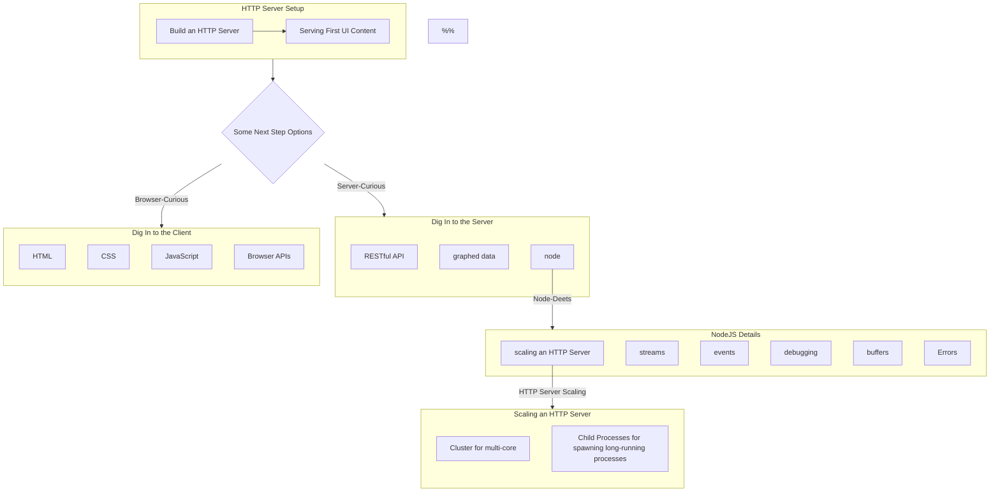

# A Web-First Path

The UI of a website and a web "app" are visually rewarding to work on - changing item colors, shapes, functionalities for the end-user...  
There are a lot of nuances in a lot of technologies involved in building web-based tools, though. This is the beginning of a set of tech to

## Frontend

- html
- css
- js
- [the browser & its APIs](https://developer.mozilla.org/en-US/docs/Web/API)

## The HTTP Server

- Building an http server using node & express

### Serving content

HTTP(s) server can serve many "types" of content:

- serving data through restful data endpoints
  - getting data to serve
    - from the server host machine file-system
    - from another db server
  - building restful endpoints
    - considering resources & sub-resources
    - leveraging http methods for performing several "actions" on a resource

### Serving Pages and Docs

- Serving a Single-Page App from an api
- Serving Server-Side Render

### Vertical Scaling

Node provides some handy apis for scaling node.

## A Visual Path

Starting From the Http Server

